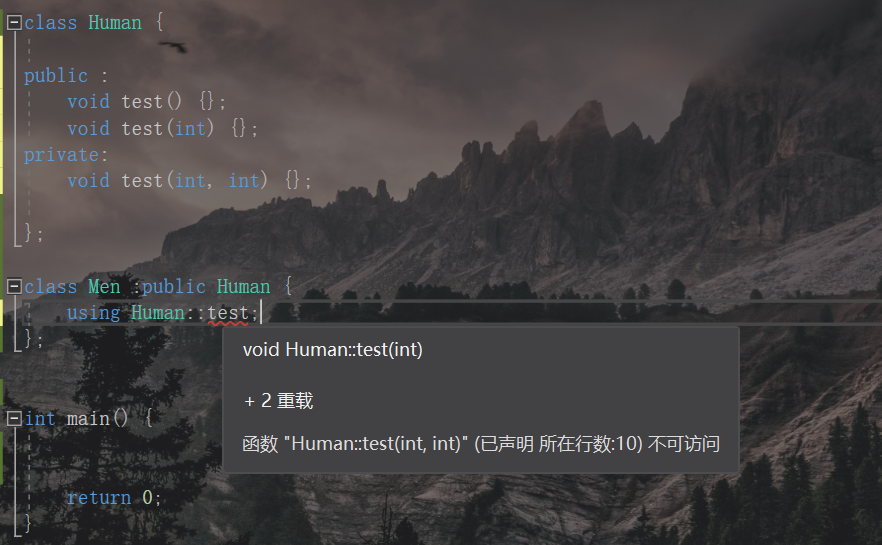

### 语法基础一

##### auto、头文件防卫、引用、常量

###### 1：局部变量及初始化

​	1.1 大括号初始化

###### 2：auto

​	1.1 变量的自动类型推断，发生在编译期间，声明要赋予初值。

###### 3：头文件防卫式声明

​	1.1 条件编译：ifdef,ifndef.	endif.

###### 4：引用 &

​	1.1 &不为取地址而是标识为引用。定义引用并不额外占用内存空间。

​	1.2 引用必须绑定到变量身上。

```c++
int a = 0; int &b = a;
```

###### 5：常量

​	1.1 const

​	1.2 constexper：在编译时求值，能提升效率

##### 命名空间

​	 命名空间可以不连续，可以写在多个文件中。若已经定义了命名空间a，再写`namespace a{}`那么为打开该命名空间，并添加新成员声明。

使用命名空间：using namespace 空间名;

使用命名空间中的实体：命名空间::实体名;

##### 输入输出

​	1.1 cin,cout

​	1.2 endl：换行，以及强制刷新输出缓冲区(把缓冲区内容网屏幕输出)

​	1.3 避免以下写法，在不同编译器中出现的结果可能不一样

```c++
int i = 3;	cout << i-- << i--;
```

##### 范围for循环

`for(auto x:{ }){ }`

在这种for语句中，不能改变容器中的容量，因为for在一开始会定位容器的结束位置，改变之后，容器结束位置会发生变化。在其他的for中，若非要改变容器容量，则需要重新获取容器结束位置。

```c++
int v[]{1,2,3,4,5};
for(const auto &x : v) cout << x;
```

##### new内存动态分配

​	1.1 内存分区：

（1）：栈：一般函数中的局部变量，由编译器自动分配和释放

（2）：堆：由`malloc` / `new` 分配，使用`free` / `delete`来释放，忘记释放，系统会回收。

（3）：全局/静态存储区：全局变量和静态变量static。程序结束时系统释放。

（4）：常量存储区

（5）：程序代码区域


##### nullptr

​	nullptr的引入是为了区分空指针和整型的混淆。

```c++
// 在传入NULL时，编译器会认为是形参int类型，然而我们本意希望是指针类型 
void fun(int );
void fun(int *);
```

##### 后置返回类型

​	auto放在前面表示函数返回类型放在参数列表之后，通过`->`指示。

```c++
auto fun() -> void{

}
```

##### 内联函数

​	inline影响编译器，各种编译器对其的处理各不相同。适用于函数体很小，但却频繁调用的函数，避免编译器每次申请空间将函数加载入内存。`inline`是对编译器的一个建议，编译器可以选择做或者不做，取决于编译器的诊断功能。内联函数的定义要放在头文件中，以便找到这个函数的源代码并尝试替换。缺点：代码膨胀，所以内联函数体尽量要小。

constexpr函数可以看成一种更严格的内联函数。#define宏展开也类似与inline,但有很多不同。

##### 函数杂合用法

1：函数返回类型为void

```c++
void funa(){
	return ;
}
void funb(){
	return funa();
}
```

2：函数返回指针和返回引用

​	这种情况下，注意局部变量返回存在巨大隐患。

##### 顶层const,底层const及延伸

```c++
const int *p;//p指向的内容不能通过p修改
int const * p <==> int * const p;//p指向的地方不能修改
int const * const p;//两者均不能修改
const int &b = 624;
```

##### 函数形参中带const

​	若传入的形参不希望被函数改变，建议加上const。

```c++
void fun(const struct &stu );
struct stu a;
fun(a);
const struct stu &b = a;
fun(b);
```

##### string介绍

​	1.1 string.c_str():返回一个指向string中内容的常量指针。为了与C兼容。

​	1.2 `string a =  "w" + "xy"`语法错误，若使用一个中间`string`则可以。

##### vector介绍

​	1.1 "==" :两个容器大小和对应元素均相等返回true。


#### 类型转换

##### 隐式类型转换

​	系统自动进行。

##### 显示类型转换(强制类型转换)

​	强制类型转换名\<type>(express); 

1. static_cast：静态转换，编译时就会进行类型转换检查。代码中要保证转换的安全性和正确性。

   可用于：

   a):相关类型转换，如整型和浮点型

   b):子类转父类(继承关系)

   c):`void *`(无类型指针：可以指向任何指针类型(万能指针)）与其他类型指针之间的转换

   不可用于：

   a):一般不可用于指针类型之间的转换。

2. dynamic_cast：运行时类型识别和检查。主要用于父类型和子类型之间的转换。

   

3. const_cast：去除**指针或引用**的const属性。编译时进行类型转换检查。

   ```c++
   const int a = 100;
   int *b = const_cast<int *>(&a);
   *b = 120;//这种写值行为是未定义行为,不要这么操作
   ```

   

4. reinterpret_cast：重新解释，将操作数内容解释为另一种不同的类型。处理无关类型的转换。编译时进行类型转换检查。

   常用于一下两种转换：将一个整型(地址)转换为指针；一种指针转换成另一种类型指针。按照转换后的类型重新解释内存中的内容。

   ```c++
   long long  a = 9876543212;
   int *p1 = reinterpret_cast<int *>(a);
   long long b = reinterpret_cast<long long>(p1);
   ```

   总结：强制类型转换不建议使用。因为强制类型转换能够抑制编译器报错。一般static_cast和reinterpret_cast就能很好的取代C中的类型转换。

#### 类

##### 隐式转换和explicit

```c++
#include<iostream>
using namespace std;

class Time {

public:
	Time() {};
    //初始化列表
	Time(int h, int m, int s) :hour(h), min(m), second(s) { cout << "Time(int h, int m, int s) " << endl; };
	Time(int h) { cout << "Time(int h)" << endl; };
	Time(int h, int m) { cout << "Time(int h, int m)" << endl; };

private:
	int hour;
	int min;
	int second;
};

void fun(Time t) { }
int main() {
	//均发生了隐式类型转换
	Time time = { 12,13,14 };//复制列表初始化
	//会调用只带一个参数的构造函数
	Time time1 = 12;
	Time tiume2 = (12, 13);
	fun(15);
	return 0;
}
```

​	为了避免系统进行隐式类型转换，在构造函数的声明中添加`explicit`，强制要求系统不能做隐式类型转换，则该构造函数只能够用户初始化和显示类型转换。

**对于单参数的构造函数一般都声明为`explicit`，除非有特别原因。**

​	直接在类的定义中实现的成员函数会被编译器当做`inline`处理。

##### 成员函数末尾的const

​	作用：告诉系统这个成员函数不会修改该对象里任何成员变量。
​	`const`对象只能调用`const`成员函数。

##### mutable(const的反义)

​	`mutable`的引入是为了突破`const`的限制。

​	使用`mutable`修饰成员变量，表示该成员变量永远处于可被修改状态。

##### 返回自身对象的引用

```c++
Time& Time::add_hour(int temphour){
	hour += temphour;
	return *this;
}
```

##### static成员

​	在C中，全局static变量限制该变量只能在本文件中使用。在C++中，static成员属于整个类，而不是属于某个对象，这种成员变量只有一个副本，对于这种成员变量的引用，我们使用 类名::成员变量名。成员函数前也可以加static构成静态成员函数，属于整个类的成员函数，在这种方法中只能静态的成员(都属于类)。

定义静态成员变量：在类最上方进行定义初始化。实现或者定义时不用加static。

##### 类内初始化

​	可以为类内成员提供一个初始值，在创建对象的时候，这个初始值就用来初始化该成员变量。

##### const成员变量的初始化

​	在初始化列表里赋值，或者使用类内初始化。

##### default

​	编译器为`= default`的函数自动生成函数体。非特殊的函数，不可以使用`default`，

##### delete

​	`=delete`显示禁用某个函数。

##### 拷贝构造函数

​	类的第一个参数是所属类类型的引用，若还有其他额外参数，那么这些额外参数均要有默认值。

​	拷贝构造函数第一个参数建议总是带上const，以及不加explicit。

##### 成员变量的初始化和销毁时机问题

​	先定义的成员变量先初始化，销毁时先定义的后销毁。有new，就有delete。

##### 函数遮蔽

​	若子类中有一个同名函数,则父类中无论有几个同名函数,子类中都无法访问到。若子类想调用父类的同名函数：(1) : 在子类的成员函数中使用 `父类::函数名` 

(2) 通过`using`关键字让父类同名函数在子类可以可见，`using BaseClass ::function name `

​	注：`using BaseClass ::function name`只能指定函数名，则凡是基类中public的function name子类中都可以访问。无法让父类中的同名函数部分可见。引入目的主要是用来实现在子类对象中调用父类的重载版本。

```c++
class Men:public Human
{
public:
	using Human::samefunc;
}
```



##### override

​	用来说明派生类中的虚函数是覆盖了父类中的同名函数。

##### final

​	说明该函数不能被重写。

##### 基类的析构函数一般加上virtual

​	避免父类指针指向子类，在释放时没有释放子类的情况。


