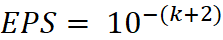

## 二分搜索

二分搜索法是通过不断缩小解可能存在的范围从而确定解的一种办法。

问题一般暗含：满足某种条件C(x)，求最小的x。

模板:

```java
class Solution{
    public boolean C(int mid){
        //根据题意求取mid对应的条件的解
        return //是否满足条件
    }
    public void solve(){
        int up = max,lb = min;
        while(up - lb > 1){
            int mid = (up + lb ) >> 1;
            if(C(mid)){
                up = mid;//调上界或者下界 以上界为例
            }
            else{
                lb = mid;//调上界或者下界 以下界为例
            }
        }
    }
}
```

二分循环的结束条件需要根据题目来判断，对应整数范围内的解，要注意区间取舍使的开闭问题，对应实数范围内要注意精度问题，避免造成死循环。

###### 整数域上

若设终止条件为`up == lb` : 通过分析具体问题，确定左右区间哪一个是可行区间，以及mid归属于哪一半段；根据结果选择`up = mid,lb = mid + 1,mid = (up + lb)/2 `和`lb = mid, up = mid - 1,mid = (l + r + 1)/2 `两种形式之一。

###### 实数域上

实数域上的结束条件只需要确定好对应的精度EPS，以`up - lb > EPS`结束，每次选择`up = mid 或 lb = mid`的分支就可。一般需要保留`k`位小数时，可以取 ，通常也可以取`10e-10 ~ 1-e-8`,可以根据样例答案进行精确。

###### lower_bound - java

```java
public int lower_bound(int[] a, int key, int l, int r) {
    int len = r - l, first = l, mid = 0;
    while (len > 0) {
        int half = len >> 1;
        mid = first + half;
        if (a[mid] < key) {//*注意*
            first = mid + 1;
            len = len - half - 1;
        } else {
            len = half;
        }
    }
    return first;
}
```

###### upper_bound - java

```java
public int upper_bound(int[] a, int key, int l, int r) {
    int len = r - l, first = l, mid = 0;
    while (len > 0) {
        int half = len >> 1;
        mid = first + half;
        if (key < a[mid]) {//*注意*
            len = half;
        } else {
            first = mid + 1;
            len = len - half - 1;
        }
    }
    return first;
}
```

> tips：某些题使用二分的次数可能不止一次，有二重二分等待，也可能结合数据结构进行求解。某些题也可能并不是枚举答案，而是枚举可能得到答案的递推关系的第一项。

a/k向上取整：(a + k - 1) / k