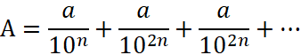
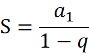
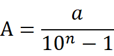
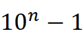
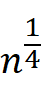
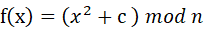
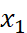
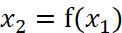
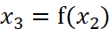
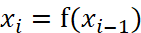

## 数学问题

### 最大公约数(GCD)

#### 辗转相除法(欧几里得算法)。

以除数和余数反复做除法运算，当余数为 0 时，取当前算式除数为最大公约数。

```c
//时间复杂度O(log max(a,b))
int gcd(int a, int b) {
	if (b == 0) return a;
	return gcd(b, a%b);
}
```

#### 扩展欧几里得算法

裴蜀定理：若a,b是整数,且gcd(a,b)=d，那么对于任意的整数x,y,ax+by都一定是d的倍数，特别地，一定存在整数x,y，使ax+by=d成立。

> 设整数a,b(a>b)
>
> a=(a/b)*b+c   ····①
>
> b=(b/c)*c+d   ····②
>
> c=(c/d)*d+0   ····③
>
> 则d为a,b的最大公约数，将d反带入得d=(mn-1)b-an → ax+by=gcd(a,b)
>
> ax+by=1时，当且仅当a,b互质。

算法设计：

> 使用递归定义，假设已经得到bx'+(a%b)y'=gcd(a,b)
>
> 因为：a%b=a-(a/b),得到ay'+b(x'-(a/b)y')=gcd(a,b)
>
> 当b=0时，有，a\*1+b\*0=a=gcd(a,b) //相当于将③的下一步递归进gcd，判断得到gcd(a,b)

```c++
#include <iostream>
#include <algorithm>
using namespace std;

int extgcd(int a, int b, int&x, int &y) {
	int d = a;
	if (b != 0) {
		d = extgcd(b, a%b, y, x);
		y -= (a / b)*x;
	}
	else {
		x = 1, y = 0;
	}
	return d;
}

int main() {
	int a, b, x = 0, y = 0;
	cin >> a >> b;
	extgcd(a, b, x, y);
	cout << x << " " << y;
	return 0;
}
```


### 最小公倍数

最小公倍数等于两数之积除以其最大公约数。

```c
int lcm(int a, int b){
	return (a * b) / gcd(a, b);
}
```

```java
class Solution {
	public int lcm(int a, int b) {
		int c = a * b;
		if (a < b) {
			int r = 0;
			r = a;
			a = b;
			b = r;
		}
		while (true) {
			int r = a % b;
			if (r == 0) {
				return c / b;
			} else {
				a = b;
				b = r;
			}
		}
	}
}

```

### 有关素数的算法

#### 素数判定

n的约束不会大于sqrt(n)

```c++
//时间复杂度O(sqrt(n))
bool is_prime(int n) {
	for (int i = 2; i * i <= n; i++)
		if (n%i == 0) return false;
	return n != 1;
}
```

> 了解：约数枚举 整数分解

#### 埃氏筛法

在2~n中，最小素数为2，故划去所有2的倍数，然后是3，则划去3所有的倍数······，最终剩下的就是素数。

复杂度O(nloglogn)

```c
#define maxsize 100
int prime[maxsize + 1];
bool is_prime[maxsize + 1];
int sieve(int n) {
	for (int i = 0; i <= n; i++)
		is_prime[i] = true;
	is_prime[0] = is_prime[1] = false;
	int p = 0;
	for (int i = 2; i <= n; i++) {
		if (is_prime[i]) {
			prime[p++] = i;
			for (int j = i * 2; j <= n; j += i) 
				is_prime[j] = false;
		}
	}
	return p;
}
```

#### 区间筛法

对于区间 [a,b)，对于b只需要检测到sqrt(b),故先筛出 [2,sqrt(b)) 的素数表，然后筛的同时，在区间[a,b)中划去当前被筛的数的倍数。使用max(2LL, (a + i - 1) / i)*i 来算出[a,b)中从2起的倍数，最后0—(b-a)中true的个数为素数个数。

```c++
#define maxsize 100
typedef long long ll;
bool is_prime[maxsize], is_prime_small[maxsize];
//is_prime[i-a]=true → i为素数
void segment_sieve(ll a, ll b) {
	for (int i = 0; (ll)i * i < b; i++)//根据[a,b)和[a.b]取等号 默认左闭右开
		is_prime_small[i] = true;
	for (int i = 0; i < b - a; i++)
		is_prime[i] = true;
	for (int i = 2; (ll)i*i < b; i++) {
		if (is_prime_small[i]) {
			for (int j = 2 * i; (ll)j*j < b; j += i)
				is_prime_small[j] = false;
			for (ll j = max(2LL, (a + i - 1) / i)*i; j < b; j += i)
				is_prime[j - a] = false;
		}
	}
}
```

> 有关素数的算法可以想到打表，既然打表就会有查找，查找就可以利用前一项和后一项的(规律)关系再次打表快速算出想要的结果

### 模运算

#### 快速幂

x^n=((((x^2)^2)^2)^2)··· ,n=2^k1+2^k2+·····,也可以将n理解为二进制形式

```c++
typedef long long ll;
//n>0
ll mod_pow(ll x, ll n, ll mod) {
	ll res = 1;
	while (n) {
		if (n & 1) res = res *  x% mod;
		x = x * x % mod;
		n >>= 1;
	}
	return res;
}
```

### 小数化分数

#### 概念

循环节：如果无限小数的小数点后，从某一位起向右进行到某一位止的一节数字循环出现，首尾衔接，称这种小数为循环小数，这一节数字称为循环节。 

#### 纯循环小数

设纯循环小数A=0.aaa...，其中a是长度为n的循环节。得到分数求和形式：



由无穷递降等比数列求和公式：

得：，故分母为,即为n个9，分子为循环节

#### 混循环小数

分子：小数部分减去不循环数字；分母：循环节几位就写几个9，不循环数字几位就写几个0(设循环节k位，不循环数字c位,那么分母=10^(k+c)-10(k))

例如：0.262524(2524循环)=(262524-26)/999900


### 分解质因数

```c
for (int i = 2; i * i <= num; i++) {
	while (num % i == 0) {
		num /= i;
	}
}
```


## 基础数论

### 费马小定理

如果p是一个质数，而整数a不是p的倍数，则有a^(p-1)≡1(mod p).

#### 证明

引理1(剩余系定理):

若a,b,c为任意3个整数，m为正整数，且(m,c)=1,则当ac ≡ c(mod m)时，a≡b(mod m)

证明:ac≡bc(mod m) → ac - bc ≡ 0(mod m) → (a - b)c ≡ 0

因为(m,c)=1,故m|(a-b) (m整除(a-b)),所以约去c → a ≡ b(mod m)

引理2(欧拉定理):

设m是一个整数且m>1，b是一个整数且(m,b)=1。如果a[1],a[2],a[3],a[4],…a[m]是模m的一个完全剩余系，则b·a[1],b·a[2],b·a[3],b·a[4],…b·a[m]也构成模m的一个完全剩余系。证明:若存在2个整数b·a[i]和b·a[j]同余即b·a[i]≡b·a[j](mod m)..(i>=1 && j>=1)，根据引理1则有a[i]≡a[j](mod m)。根据完全剩余系的定义可知这是不可能的，因此不存在2个整数b·a[i]和b·a[j]同余。所以b·a[1],b·a[2],b·a[3],b·a[4],…b·a[m]构成模m的一个完全剩余系。

证明：构造素数p的完全剩余系：P={1,2,....,p-1}

给定一个整数a,且(a,p)=1由引理2可得：A={a,2a,...,(p-1)a} 也为P的完全剩余系，

故

得到：

### 米勒-拉宾素性检验(Miller-Rabin)

#### 证明

引理：.svg)和.svg)总是得到1，我们称-1和1为1 mod p 的“平凡平方根”，当p为素数且p>2时，不存在1 mod p 的"非平凡平方根"(即：只存在平凡平方根)。

证明：设x为1 mod p的平凡平方根，则：	

​																		.svg)			

​															.svg)

所以素数p能够整除(x - 1)(x +1)或者 x= p - 1(p²-2p+1),根据[^欧几里得引理]，x - 1或者 x + 1能够被p整除，即：x ≡ 1(mod p)或者x ≡ -1(mod p)，即x是1 mod p的平凡平方根。

现假设n为素数且n > 2。于是n - 1是一个偶数，可以被表示为2^s*d，s和d均为正整数且d为奇数。对任意整数范围内的a和0<= r <= s - 1，必满足一下两种形式：

​																		.svg)

​																		.svg)

由小费马定理：对于一个素数n有：			.svg)

由引理，不断对a^(n-1)取平方根，总会得到-1或1。若得到-1，则②成立，n为素数，若从未得到-1，则①成立。

Miller-Rabin素性测试就是基于上述 的逆否，即：若能找到一个数a，使得对任意0<= r <= s - 1满足：

​																		.svg)

​																		.svg)

那么n不为素数，称a为n是合数的一个凭证，否则a可能是一个证明n是素数的“强伪证”。

取特定的整数可以在一定范围内确定（而非单纯基于概率猜测）某个整数是素数还是合数。对于小于 2^{32}的情形，选取2,7,61共三个凭据可以做到这一点;对于小于2^{64}的情形2,325,9375,28178,450775,9780504,1795265022共七个凭据可以做到这一点。

伪代码：

```
write n − 1 as 2r·d with d odd by factoring powers of 2 from n − 1
WitnessLoop: repeat k times:
   pick a random integer a in the range [2, n − 2]
   x ← ad mod n
   if x = 1 or x = n − 1 then
      continue WitnessLoop
   repeat r − 1 times:
      x ← x2 mod n
      if x = n − 1 then 
         continue WitnessLoop
   return composite
return probably prime
```

> tip:-1 mod n = n - 1,负数取余：先使用倍数将其装换为正数，然后取余

#### 代码

```c++
#include <iostream>
#include <algorithm>
#include <cstdlib>
#include <ctime>
using namespace std;
typedef long long ll;
//(a * b)%mod 
ll mod_muti(ll a, ll b, ll mod) {
	ll res = 0;
	while (b) {
		if (b & 1)
			res = (res + a) % mod;
		a = (a << 1) % mod;
		b >>= 1;
	}
	return res;
}
//(a^b)%mod
ll mod_pow(ll a, ll b, ll mod) {
	ll res = 1;
	while (b) {
		if (b & 1)
			res = mod_muti(res, a, mod);
		a = mod_muti(a, a, mod);
		b >>= 1;
	}
	return res;
}
bool MR(ll num, ll times) {
	if (num < 2) return false;
	if (num == 2) return true;
	if (!(num & 1)) return false;
	ll d = num - 1, r = 0;
	while (d % 2 == 0) {
		d >>= 1;
		r++;
	}
	srand(time(NULL));
	for (ll i = 0; i < times; i++) {
		int a = rand() % (num - 1) + 1;
		int x = mod_pow(a, d, num);
		if (x == 1 || x == num - 1) continue;
		bool flag = true;
		for (ll k = 0; k < r; k++) {
			x = mod_muti(x, x, num);
			if (x == num - 1) {
				flag = false;
				break;
			}
		}
		if (flag)
			return false;
	}
	return true;
}
int main() {
	cout << MR(5, 5);
	return 0;
}
```


```c++
#define TIMES 3
typedef long long ll;
int test[TIMES] = { 2,7,61 };

bool MR(ll num, ll times) {
	if (num < 2) return false;
	if (num == 2) return true;
	if (!(num & 1)) return false;
	ll d = num - 1, r = 0;
	while (d % 2 == 0) {
		d >>= 1;
		r++;
	}
	for (ll i = 0; i < times; i++) {
		int a = test[i];
		int x = mod_pow(a, d, num);
		if (x == 1 || x == num - 1) continue;
		bool flag = true;
		for (ll k = 0; k < r; k++) {
			x = mod_muti(x, x, num);
			if (x == num - 1) {
				flag = false;
				break;
			}
		}
		if (flag)
			return false;
	}
	return true;
}
int main() {
	cout << MR(4, TIMES);
	return 0;
}
```

### Pollard-Rho算法(大数分解)

#### 问题描述

给定一个正整数n，将n分解为若干素数相乘的形式

##### 思路

对于因式分解，最简单的思路是使用试除法从[1,√n]进行筛选，复杂度为(O(√n))，但对于大数来说这个算法复杂度过于大。所以接下来的思路是如何提高算法的成功率。

根据[^生日悖论]，采用"组合随机采样"的方法：假设其中一个因子为a，可以在k个随机数中选取两个因子xi,xj，使得xi-xj=a,，其成功率将会大大提高。例如：在[1,1000]中选取一个数为50，概率为1/1000，但若在其中选取两个数x,y，使x-y=50，那么概率将会提高。

##### 进一步优化

采用组合随机采样提高了成功率，但是若使用试除法，还是不够优化。但是我们知道最大公约数一定是某个数的约数，所以可以：选取k个数，x1,x2,......,xk，若gcd(|xi-xj|,n) > 1，则gcd(|xi-xj|,n)是n的一个因子，然后继续进行递归分解因子gcd(|xi-xj|,n)和n/gcd(|xi-xj|,n)。时间复杂度提高了，但是需要选取的数太多，有证明表示需要选取的数大约是O()，当n太大是内存无法存储这么多数。

##### Pollard Rho的随机函数

为了解决无法存储太多数的问题，可以构造一个伪随机数序列，然后取相邻两项来求gcd，Pollard Rho设计了一个优秀生成伪随机数的函数：其中 c 是一个随机参数。随机取一个，，，在一定范围内这个数列是随机的。在某些数据下，这个函数一定会出现环，从而造成循环。

##### 基于Floyd算法优化的Pollard Rho

对于判断一个环的存在，Floyd设计一种算法，使用两个节点A,B，让B以A的二倍速跑，当B第一次追上A时，B就比A多走了一圈，即存在环。

###### 算法描述

```c
ll F(int x, int c, int n) {
	return ((x*x) + c) % n;
}

ll Pollard_Rho(ll n) {
	ll c = rand() % (n - 1) + 1;
	ll a = F(rand() % (n - 1), c, n);
	ll b = F(a, c, n);
	while (a != b) {
		ll d = gcd(abs(a - b), n);
		if (d > 1) return d;
		a = F(a, c, n);
		b = F(F(b, c, n), c, n);
	}
	return n;//未找到 调整参数c
}
```

此算法存在的问题：在程序测试中，当n=4时，无法分解，因为该f(x)在mod 4的情况下，无法得到a-b=2的随机数，猜想原因是：固定2倍速跑，过早进入循环。

##### 基于Brent算法优化的Pollard Rho

> <font size = 2>上述Floyd优化出现的问题，许久没有找到解决办法，但是发现基于Brent的算法可以运算出正确答案，但是不确定是否此算法是为了解决上述问题而提出(许多博客使用了次算法却没有阐明原因)，但事实上Brent的判圈法更快</font>


### 基于Miller-Rabin的Pollard-Rho大数分解算法

##### 实现

```c++
#include <iostream>
#include <algorithm>
#include <ctime>
using namespace std;
typedef long long ll;

ll Pollard_Rho(ll n, ll c) {
	ll i = 1, k = 2;
	ll x = rand() % (n - 1) + 1;
	ll y = x;
	while (true) {
		i++;
		x = (mod_mult(x, x, n) + c) % n;
		ll d = gcd((y - x + n) % n, n);
		if (d > 1 && d < n) return d;
		if (y == x) return n;
		if (i == k){
			y = x;
			k <<= 1;
		}
	}
}

ll counter, fac[100];
void findfac(ll n, int c) {
	if (MR(n, TIMES)) {
		fac[counter++] = n;
		return;
	}
	ll p = n, k = c;
	while (p >= n) p = Pollard_Rho(n, c--);//防止死循环
	findfac(p, k);
	findfac(n / p, k);
}

int main() {
	srand(time(NULL));
	findfac(424, 120);
	for (int i = 0; i < counter; i++)
		cout << fac[i] << " ";
	cout << endl;
	return 0;
}

```


[^欧几里得引理]: 如果一个素数整除两个正整数的乘积，那么这个素数可以至少整除这两个正整数中的一个。如果 p|bc，那么p|b或者p|c；如果a|bc ，gcd(a,b)=1 那么 a|c

[^生日悖论]: 生日悖论是指在不少于 23 个人中至少有两人生日相同的概率大于 50%。

