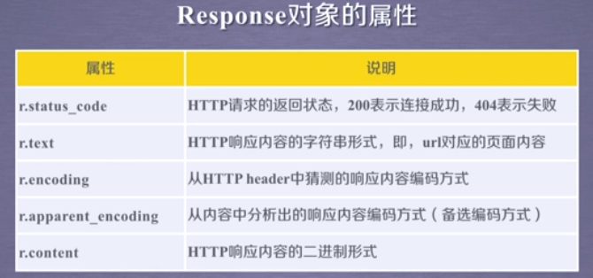
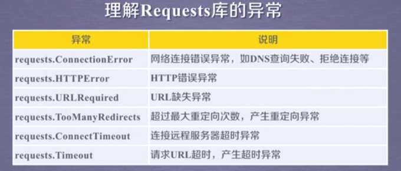
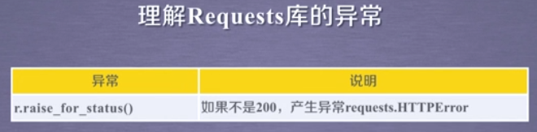
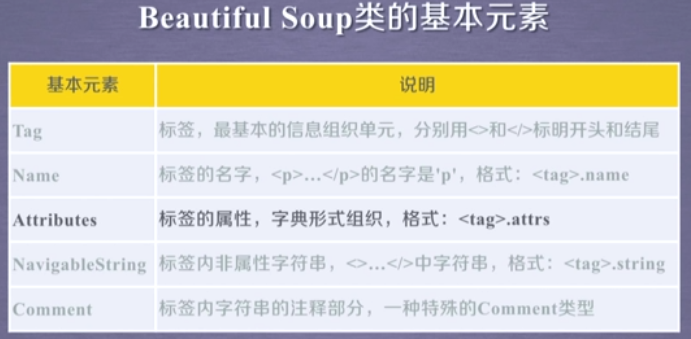
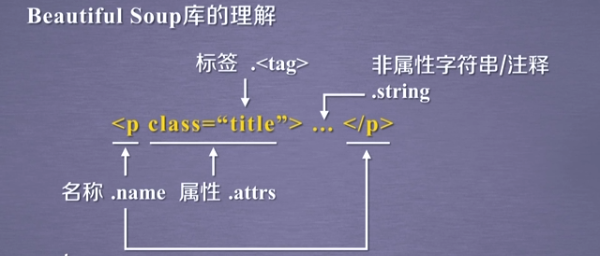
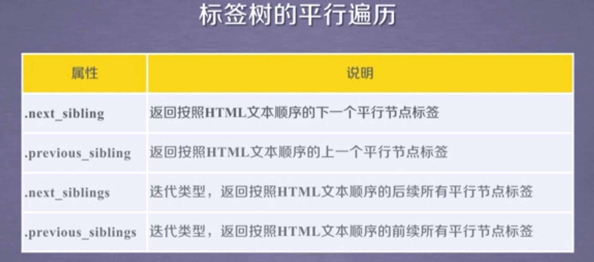
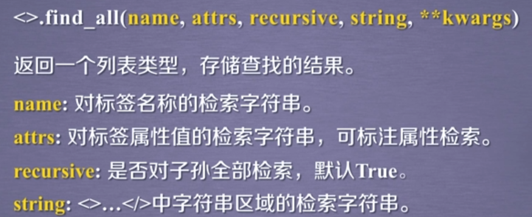
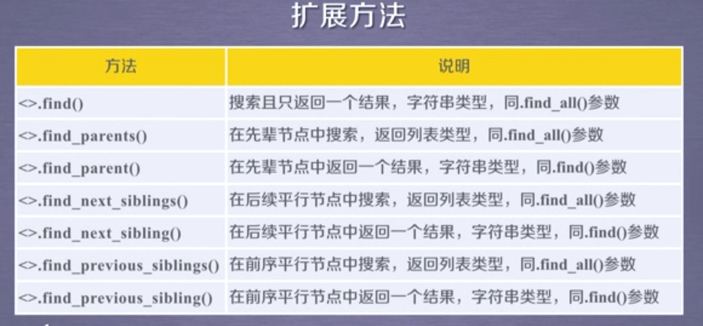

### request.get()

构造一个向服务器请求资源的Request对象，返回一个包含服务器资源的Response对象









```python
try:
	r = requests.get(url,timeout=30)
	r.raise_for_status()
	r.encoding=r.apparent_encoding
	return r.text
except:
	return "产生异常"
```











