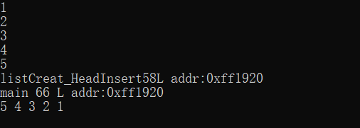
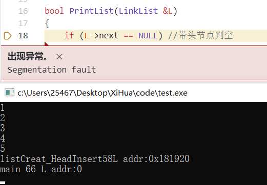
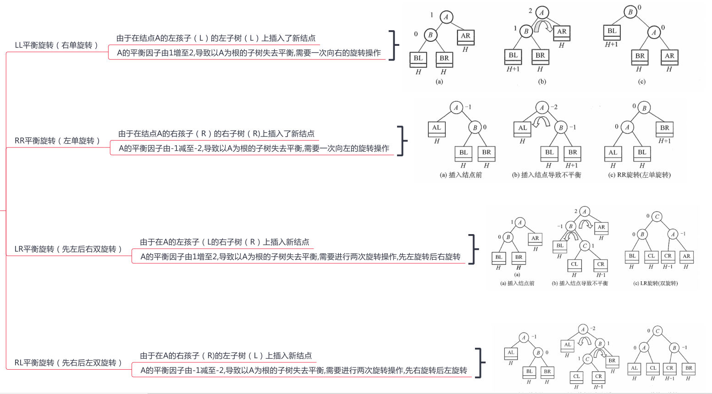
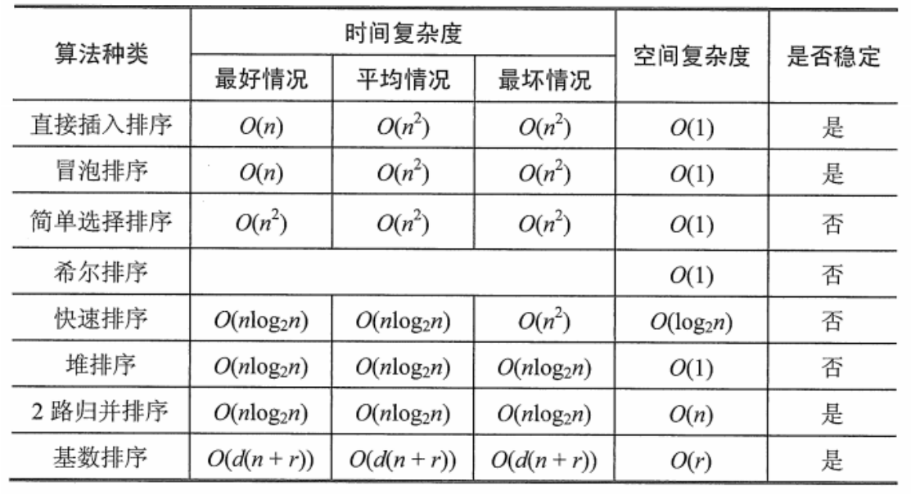

# 数据结构知识点总结

## 一、基本概念

### 数据结构的三要素

​	数据元素是数据的基本单位。数据元素有由若干数据项构成，数据项是最小单位，不可再分。

#### 1. 逻辑结构

​	描述数据元素之间的**逻辑关系**，与存储无关。

##### 分类

1. ###### 线性结构

   + 线性表
   + 栈
   + 队列
   + 数组(线性表的推广)

   > 链表是线性表的一种存储方式，逻辑结构是线性结构中的线性表。

2. ###### 非线性结构

   + 树
   + 图
   + 集合

#### 2. 存储结构(物理结构)

​	数据元素在计算机中表示。包括数据元素的表示和关系的表示(方法)。

##### 分类

1. 顺序存储

   + 描述：让逻辑相邻的元素在物理上也相邻，即：逻辑上的相邻**由元素在计算机中的存储单元的地址相邻来表示**

   + 优点：随机存取，每个元素占用空间最少
   + 缺点：需要一块连续内存，因此可能产生较多碎片

2. 链式存储

   + 描述：不要求逻辑相邻的元素在物理上也相邻，但逻辑上的相邻**由指针来表示**
   + 优点：不会出现碎片现象，充分利用存储空间
   + 缺点：元素因为指针增加了额外空间，且只能顺序存取

3. 索引存储

   + 描述：存储元素信息是，建立附加的索引表
   + 优点：检索速度快
   + 缺点：索引表额外占用空间；增删元素需要修改索引表，耗费时间

4. 散列存储

   + 描述：根据元素关键字计算出存储地址
   + 优点：检索、增删操作快
   + 缺点：若散列函数不好，可能引起元素存储地址冲突，解决冲突耗时
   
   > **逻辑结构可以由不同的存储结构实现**

#### 3. 运算

​	方法的定义(针对逻辑结构：指出运算的功能)和实现(针对存储结构：指出运算的实现)

### 算法

​	指令的有限序列。

#### 特性

1. 有穷性
2. **确定性**
3. **可行性**
4. 输入：0个或多个
5. 输出：至少一个

> 即：一个算法不能无穷的进行，还要保证相同的输入得到的结果是确定的(相同的)，同时算法需要是可行的

#### 度量

##### 时间复杂度

$$
T(n)=O(f(n))
$$


##### 空间复杂度

​	算法原地工作：算法需要的辅助空间为常量即`O(1)`


## 二、线性表

定义：相同数据类型的数据元素的有限序列。

### 特点

1. 元素个数有限
2. 元素逻辑上相邻，表中元素有先后次序
3. 数据元素是单个元素
4. 每个元素占有相同存储空间

### 基本操作(方法)声明

```c++
//下文已实现
bool PrintList(LinkList &L);

bool DestroyList(LinkList &L);

LinkList listCreat_HeadInsert(LinkList &L);

LinkList listCreat_TailInsert(LinkList &L);

LNode *GetElem(LinkList &L, int pos);

LNode *ListInsert(LinkList &L, int pos, ElemType data);

LNode *ListDelete(LinkList &L, int pos, ElemType &data);
//下文未实现
int Length(LinkList &L);
LNode *LocateElem(LinkList &L, ElemType data);//按值查找
bool Empty(LinkList &L);
```

### 顺序存储表示(顺序表)

#### 顺序表特点

      1. 随机访问，通过地址或下标实现`O(1)`时间查找
      2. 存储密度高，每个节点只存储数据元素
      3. 逻辑上相邻的元素物理上也相邻，增删时移动元素耗时

#### 一维数组实现

1. 静态分配

   ```c++
   const int N = 100;
   ElemType array[N];
   ```

2. 动态分配

   ```C++
   const int N = 100;
   ElemType *array = (ElemType*)malloc(sizeof(ElemType)*N);
   free(array);
   //当内存不够，重新分配
   const int addSize=5;
   ElemType *r_array =(ElemType *)realloc(array,sizeof(ElemType)*(N+addSize));
   //realloc返回的是原来malloc的地址，即：r_array和array是同一个地址，所以只需要释放一次
   ```

#### 基本操作实现

##### 1.插入

1. 插入时需要将部分元素后移

2. 平均复杂度`O(n)`
   $$
   在i处插入节点的概率(下标从1开始):p_i=\frac{i}{n+1} \quad (有n+1个地方可以插入)\\
   节点平均移动次数:\sum_{i=1}^n p_i(n-i+1) = \frac{n}{2}
   $$
   

##### 2.删除

1. 删除时需要将部分元素前移`O(n)`

2. 平均复杂度
   $$
   删除i处节点:p_i=\frac{1}{n} \quad (n个节点可以删除)\\
   节点平均移动次数:\sum_{i=1}^n p_i(n-i)=\frac{n-1}{2}
   $$
   

##### 3.按值查找

1. 平均复杂度`O(n)`
   $$
   被查找的值在i节点处:p_i=\frac{1}{n} \quad\qquad \\
   节点平均查找次数:\sum_{i=1}^n p_i\cdot i=\frac{n+1}{2}
   $$
   

### 链式存储表示(链表)

#### 链表特点

1. 优点：不需要使用连续地址，增删不需要移动元素
2. 缺点：失去随机存储的优点

#### 实现方式

1. 带头节点
   + 判空:`L->next == NULL`
2. 不带头节点：
   + 判空:`L == NULL`

#### 链表基本操作实现

##### 按位查找、打印链表、销毁链表

```C++
LNode *GetElem(LinkList &L, int pos)
{
    if (L->next == NULL)
        return NULL;
    LNode *ptr = L->next;
    int i = 1;
    while (ptr && i < pos)
    {
        ptr = ptr->next;
        i++;
    }
    return ptr;
}

bool PrintList(LinkList &L)
{
    if (L->next == NULL) //带头节点判空
        return false;
    LNode *p = L->next; //带头节点第一个元素
    while (p != NULL)
    {
        cout << p->data << " ";
        p = p->next;
    }
    cout << endl;//换行
    return true;
}

bool DestroyList(LinkList &L)
{
    if (L == NULL)
        return true;
    LNode *delnode = L;
    while (delnode != NULL)
    {
        L = L->next;
        free(delnode);
        delnode = L;
    }
    return true;
}
```


#### 单链表实现

##### 结构定义

```c++
typedef struct LNode
{
    ElemType data;
    struct LNode *next;
}LNode,*LinkList;
```

##### 基本操作实现

###### 创建链表

1. 头插法：将新节点插入到表头

   ```C++
   #include <stdio.h>
   #include <stdlib.h>
   #include <iostream>
   
   using namespace std;
   
   const int N = 5;
   typedef int ElemType;
   
    typedef struct LNode
   {
       ElemType data;
       struct LNode *next;
   } LNode, *LinkList;
   
   bool PrintList(LinkList &L);
   bool DestroyList(LinkList &L);
   LinkList listCreat_HeadInsert(LinkList &L)
   {
       LNode *node = NULL;
       ElemType input_data;
       L = (LNode *)malloc(sizeof(LNode)); //带头节点，不带头节点则删除该语句
       L->next = NULL;                     //初始化投节点的next指针
       while ((cin >> input_data))
       {
           node = (LNode *)malloc(sizeof(LNode)); //创建新节点
           node->data = input_data;               //输入数据
           /*头插法：先让新节点的next指向头节点的next,再让头节点next指向新节点*/
           node->next = L->next;
           L->next = node;
       }
       // cout << __FUNCTION__ << __LINE__ << "L addr:" << L << endl;
       return L;
   }
   
   int main()
   {
       LinkList L = NULL;
       listCreat_HeadInsert(L);
       // cout << __FUNCTION__ << " " << __LINE__ << " L addr:" << L << endl;
       PrintList(L);
       DestroyList(L);
       return 0;
   }
   ```
   

**注：关于&**

   若**LinkList listCreat_HeadInsert(LinkList &L)**中加&

```C++
int main()
{
    LinkList L = NULL;
    listCreat_HeadInsert(L);//正确
    PrintList(L);
    DestroyList(L);
    return 0;
}
```


   

   若**LinkList listCreat_HeadInsert(LinkList &L)**中**不**加&

```C++
int main()
{
    LinkList L = NULL;
    //listCreat_HeadInsert(L);//报错
    L = listCreat_HeadInsert(L);//正确写法
    PrintList(L);
    DestroyList(L);
    return 0;
}
```


   

​	造成这种原因时因为，函数在传递参数的时候，会进行值拷贝，而传&则不会进行值拷贝。

2. 尾插法：将新节点插入到表尾

   ```C++
   LinkList listCreat_TailInsert(LinkList &L)
   {
       LNode *node = NULL, *tail = NULL;
       ElemType input_data;
       L = (LNode *)malloc(sizeof(LNode)); //带头节点，不带头节点则删除该语句
       L->next = NULL;                     //初始化投节点的next指针
       tail = L;                            // 让tail指向头节点,也是当前的尾节点
       while ((cin >> input_data))
       {
           node = (LNode *)malloc(sizeof(LNode)); //创建新节点
           node->data = input_data;               //输入数据
           node->next = NULL;                     //初始化新节点的next
           /*尾插法：让tail的next指向新节点,然后更改当前tail指针指向新节点*/
           tail->next = node;
           tail = node;
       }
       // cout << __FUNCTION__ << __LINE__ << "L addr:" << L << endl;
       return L;
   }
   
   
   int main()
   {
       LinkList L = NULL;
       listCreat_TailInsert(L);
       PrintList(L);
       DestroyList(L);
       return 0;
   }
   ```

###### 插入节点

```C++
LNode *ListInsert(LinkList &L, int pos, ElemType data)
{
    if (L->next == NULL)
        return NULL;
    LNode *ptr = GetElem(L, pos - 1); //获取i-1处的节点
    LNode *newNode = (LNode *)malloc(sizeof(LNode));
    newNode->data = data;
    /*插入节点*/
    newNode->next = ptr->next;
    ptr->next = newNode;
    
    return newNode;
}
```

###### 删除节点

通过寻找到前一个节点来进行删除

```C++
LNode *ListDelete(LinkList &L, int pos, ElemType &data)
{
    if (L->next == NULL)
        return NULL;
    LNode *ptr = GetElem(L, pos - 1); //获取i-1处的节点
    LNode *delNode = ptr->next;       //得到i处的节点
    data = delNode->data;             //获取被删除内容
    ptr->next = delNode->next;        //从链表中删除
    free(delNode);                    //释放内存
    delNode = NULL;                   //置空
    return ptr;
}
```

将下一个节点的值保存在需要被删除的节点中，然后通过删除下一个节点实现删除

```C++
LNode *ListDelete2(LinkList &L, int pos, ElemType &data)
{
    if (L->next == NULL)
        return NULL;
    LNode *ptr = GetElem(L, pos); //获取i处的节点
    LNode *nextNode = ptr->next;  //得到i+1处的节点
    data = ptr->data;             //获取被删除内容
    ptr->data = nextNode->data;   //将第i+1节点内容复制到第i个节点中
    ptr->next = nextNode->next;    //从链表中删除第i+1个节点
    free(nextNode);                //释放内存
    nextNode = NULL;               //置空
    return ptr;
}
```


#### 双链表

##### 结构定义

```C++
typedef struct DNode
{
    ElemType data;
    struct DNode *prior, *next;
} DNode, *DLinkList;
```

##### 基本操作实现

```C++
bool PrintList(DLinkList &L)
{
    if (L->next == NULL) //带头节点判空
        return false;
    DNode *p = L->next; //带头节点第一个元素
    while (p != NULL)
    {
        cout << p->data << " ";
        p = p->next;
    }
    cout << endl; //换行
    return true;
}

bool DestroyList(DLinkList &L)
{
    if (L == NULL)
        return true;
    DNode *deDNode = L;
    while (deDNode != NULL)
    {
        L = L->next;
        free(deDNode);
        deDNode = L;
    }
    return true;
}

```

###### 创建链表

1. 头插法

   ```C++
   DLinkList DlistCreat_HeadInsert(DLinkList &L)
   {
       DNode *node = NULL;
       ElemType input_data;
       L = (DNode *)malloc(sizeof(DNode)); //带头节点，不带头节点则删除该语句
       L->prior = NULL;                    //初始化投节点的prior指针
       L->next = NULL;                     //初始化投节点的next指针
       while ((cin >> input_data))
       {
           node = (DNode *)malloc(sizeof(DNode)); //创建新节点
           node->data = input_data;               //输入数据
           /*头插法：先让新节点的next指向头节点的next,再让头节点next的prior指向新节点
           再让头节点next指向新节点,新节点prior指向头节点*/
           node->next = L->next;
           L->next->prior = node;
           L->next = node;
           node->prior = L;
       }
       return L;
   }
   int main()
   {
       DLinkList L = NULL;
       DlistCreat_HeadInsert(L);
       PrintList(L);
       DListInsert(L,3,8);
       int temp;
       DListDelete(L,4,temp);
       DestroyList(L);
       return 0;
   }
   ```

   

2. 尾插法

   ```C++
   DLinkList DlistCreat_TailInsert(DLinkList &L)
   {
       DNode *node = NULL, *tail = NULL;
       ElemType input_data;
       L = (DNode *)malloc(sizeof(DNode)); //带头节点，不带头节点则删除该语句
       L->prior = NULL;                    //初始化投节点的prior指针
       L->next = NULL;                     //初始化投节点的next指针
       tail = L;                           // 让tail指向头节点
       while ((cin >> input_data))
       {
           node = (DNode *)malloc(sizeof(DNode)); //创建新节点
           node->data = input_data;               //输入数据
           node->next = NULL;                     //初始化新节点的next
           /*尾插法：让tail指向的节点的next指向新节点,新节点的prior指向tail,然后更改当前tail指针指向新节点*/
           tail->next = node;
           node->prior = tail;
           tail = node;
       }
       // cout << __FUNCTION__ << __LINE__ << "L addr:" << L << endl;
       return L;
   }
   ```

   

###### 插入节点

```C++
DNode *DListInsert(DLinkList &L, int pos, ElemType data)
{
    if (L->next == NULL)
        return NULL;
    DNode *ptr = GetElem(L, pos - 1); //获取i-1处的节点
    DNode *newNode = (DNode *)malloc(sizeof(DNode));
    newNode->data = data;
    /*插入节点*/
    newNode->next = ptr->next;
    ptr->next->prior=newNode;
    ptr->next = newNode;
    newNode->prior=ptr;

    return newNode;
}
```

###### 删除节点

```C++
DNode *DListDelete(DLinkList &L, int pos, ElemType &data)
{
    if (L->next == NULL)
        return NULL;
    DNode *delNode = GetElem(L, pos ); //获取i处的节点
    data = delNode->data;             //获取被删除内容
    /*从链表中删除*/
    delNode->prior->next=delNode->next;
    delNode->next->prior=delNode->prior;
    DNode *cur=delNode->next;        
    free(delNode);                    //释放内存
    delNode = NULL;                   //置空
    
    return cur;//返回当前在pos处的节点
}

```


#### 循环链表

##### 描述

###### 1.循环单链表

​	将尾节点next指向head。

###### 2.循环双链表

​	将尾节点tail->next指向head，头节点head->prior指向tail。

> 补充代码


#### 静态链表

##### 特点

	1. 静态链表以`next==-1`为结束标志
	2. 增删只需要修改next指针，而不需要移动元素

##### 结构定义

```C++
const int N = 10;
typedef int ElemType;

typedef struct SNode
{
    ElemType data;
    int next;
} SLinkList[N];
//使用SLinkList定义大小为N的SNode结构体数组
```

##### 基本操作实现

###### 插入节点


###### 删除节点


## 三、栈和队列

### 栈

​	描述：先进后出。线性表

#### 卡特兰数

​	n个不同元素进栈出栈，不同的排列个数：
$$
\frac {\mathcal{C}_{2n}^n}{n+1}
$$

#### 基本操作(方法)声明

```C++
void InitStack(SqStack &S);

bool StackEmpty(SqStack &S);

bool Push(SqStack &S, ElemType data);

bool Pop(SqStack &S, ElemType &data);

bool GetTop(SqStack &S, ElemType &data);
```

#### 顺序栈

##### 结构

```C++
const int MaxSize = 10;
typedef int ElemType;

typedef struct stack
{
    ElemType data[MaxSize];
    int top;
} SqStack;

```

##### 基本操作实现

```C++
void InitStack(SqStack &S)
{
    S.top = -1;
}

bool StackEmpty(SqStack &S)
{
    if (S.top == -1)
        return true;
    return false;
}

bool Push(SqStack &S, ElemType data)
{
    if (S.top == MaxSize - 1)
        return false;
    S.data[++S.top] = data;
    return true;
}

bool Pop(SqStack &S, ElemType &data)
{
    if (S.top == -1)
        return false;
    data = S.data[S.top--];
    return true;
}

bool GetTop(SqStack &S, ElemType &data)
{
    if (S.top == -1)
        return false;
    data = S.data[S.top];
    return true;
}
```

#### 链栈

​	采用指针实现。和链表的头插法实现类似

##### 结构

```
typedef struct linkNode{
    ElemType data;
    struct linkNode *next;
}*linkStack;
```


#### 共享栈

​	两个栈贡献栈底

​	1. 判空：`top1 - top0 == 1`

### 队列

​	描述：先进先出。线性表。

​	注：`头指针front指向堆头，尾指针rear指向队尾下一个位置`

#### 基本操作(方法)声明

```C++
void InitQueue(SqQueue &S);

bool QueueEmpty(SqQueue &S);

bool EnQueue(SqQueue &S, ElemType data);

bool DeQueue(SqQueue &S, ElemType &data);

bool GetHead(SqQueue &S, ElemType &data);
```


#### 循环队列

##### 注：大小为`MaxSize`的循环队列只能容纳`MaxSize-1`个元素，因为牺牲了一个位置使判别队满简单。

```C++
(S.rear == S.front) //循环队列判空
(S.front == (S.rear + 1) % MaxSize) //循环队列判满
 S.front = (S.front + 1) % MaxSize;//形成循环
 S.rear = (S.rear + 1) % MaxSize; //形成循环
(S.rear+MasSize-S.front) % Maxsize;//队列长度 负数%Max=(负数+Max)%Max
```

##### 结构

```C++
const int MaxSize = 10;
typedef int ElemType;

typedef struct queue
{
    ElemType data[MaxSize];
    int front, rear;
} SqQueue;

```

##### 基本操作实现

```C++
void InitQueue(SqQueue &S)
{
    /*front指向对头，rear指向队尾的下一个位置*/
    S.front = S.rear = 0;
}

bool QueueEmpty(SqQueue &S)
{
    if (S.rear == S.front) //循环队列判空
        return true;
    return false;
}

bool EnQueue(SqQueue &S, ElemType data)
{
    if (S.front == (S.rear + 1) % MaxSize) //循环队列判满
        return false;
    S.data[S.rear] = data;
    S.rear = (S.rear + 1) % MaxSize; //形成循环
    return true;
}

bool DeQueue(SqQueue &S, ElemType &data)
{
    if (QueueEmpty(S))
        return false;
    data = S.data[S.front];
    S.front = (S.front + 1) % MaxSize;
    return true;
}

bool GetHead(SqQueue &S, ElemType &data)
{
    if (QueueEmpty(S))
        return false;
    data = S.data[S.front];
    return true;
}
```

#### 链队列

##### 结构

```C++
typedef struct linkNode{
    ElemType data;
    struct linkNode *next;
}linkNode;

typedef struct linkQueue{
    struct linkNode *front,*rear;
}LinkQueue;
```

##### 基本操作


#### 双端队列

##### 	描述

		1. 两端都可以进行入队和出队操作
		2. 入队：前端元素排在后端元素前面，先进的元素位置靠近队列中间
		3. 出队：无论哪端，先出的元素排在前面
		4. 从一端进另一端出体现先进先出；从一端进并从该端出体现先进后出

​	扩展：可以有`两端入队一端出队(输出受限)`或者`两端出队一端入队(输出输入受限)`

##### 循环队列实现双端队列

```C++
#include <stdio.h>
#include <stdlib.h>
#include <iostream>

using namespace std;

const int MaxSize = 6 + 1;
typedef int ElemType;

typedef struct queue
{
    ElemType data[MaxSize];
    int front, rear;
} Deque;

void InitQueue(Deque &S)
{
    /*front指向对头，rear指向队尾的下一个位置*/
    S.front = S.rear = 0;
}

bool QueueEmpty(Deque &S)
{
    if (S.rear == S.front) //循环队列判空
        return true;
    return false;
}

bool isQueueFull(Deque &S)
{
    if (S.front == (S.rear + 1) % MaxSize) //循环队列判满
        return true;
    return false;
}

bool EnQueue_Front(Deque &S, ElemType data)
{
    if (isQueueFull(S))
        return false;
    //先--再赋值:保证front指向的是队首元素
    S.front = (S.front - 1 + MaxSize) % MaxSize; // Important
    S.data[S.front] = data;
    return true;
}

bool EnQueue_Back(Deque &S, ElemType data)
{
    if (isQueueFull(S))
        return false;
    //先赋值再--:保证rear指向的是队尾元素的下一个位置
    S.data[S.rear] = data;
    S.rear = (S.rear + 1) % MaxSize; // Important
    return true;
}

bool DeQueue_Front(Deque &S, ElemType &data)
{
    if (QueueEmpty(S))
        return false;
    //先获取值再移动指针:因为front指向的是队头元素
    data = S.data[S.front];
    S.front = (S.front + 1) % MaxSize; // Important
    return true;
}

bool DeQueue_Back(Deque &S, ElemType &data)
{
    if (QueueEmpty(S))
        return false;
    //先移动指针再赋值:因为rear指向的是队尾元素的下一个位置
    S.rear = (S.rear - 1) % MaxSize; // Important
    data = S.data[S.rear];
    return true;
}

bool GetHead(Deque &S, ElemType &data)
{
    if (QueueEmpty(S))
        return false;
    data = S.data[S.front];
    return true;
}

bool GetTail(Deque &S, ElemType &data)
{
    if (QueueEmpty(S))
        return false;
    data = S.data[(S.rear - 1 + MaxSize) % MaxSize];
    return true;
}

void PrintFront(Deque &S)
{
    for (int i = 0; i < (S.rear - S.front + MaxSize) % MaxSize; i++)
        cout << S.data[(S.front + i) % MaxSize] << " ";
    cout << endl;
}

void PrintBack(Deque &S)
{
    for (int i = 0; i < (S.rear - S.front + MaxSize) % MaxSize; i++)
        cout << S.data[(S.rear - 1 - i + MaxSize) % MaxSize] << " ";
    cout << endl;
}

```

测试

```C++
int main()
{
    Deque S;
    InitQueue(S);
    cout << "QueueEmpty: " << QueueEmpty(S) << endl;
    EnQueue_Front(S, 1); // 1
    EnQueue_Front(S, 2); // 2 1
    EnQueue_Front(S, 3); // 3 2 1
    cout << "QueueEmpty: " << QueueEmpty(S) << endl;
    PrintFront(S);
    PrintBack(S);

    EnQueue_Back(S, 4); // 3 2 1 4
    EnQueue_Back(S, 5); // 3 2 1 4 5
    EnQueue_Back(S, 6); // 3 2 1 4 6

    PrintFront(S);
    PrintBack(S);

    int temp;
    GetHead(S, temp);
    cout << "GetHead: " << temp << endl;
    GetTail(S, temp);
    cout << "GetTail: " << temp << endl;

    DeQueue_Front(S, temp);
    cout << "DeQueue_Front: " << temp << endl;

    PrintFront(S);
    PrintBack(S);

    DeQueue_Back(S, temp);
    cout << "DeQueue_Back: " << temp << endl;

    PrintFront(S);
    PrintBack(S);

    return 0;
}
```


> 输出:
>
> QueueEmpty: 1
> QueueEmpty: 0
> 3 2 1
> 1 2 3
> 3 2 1 4 5 6
> 6 5 4 1 2 3
> GetHead: 3
> GetTail: 6
> DeQueue_Front: 3
> 2 1 4 5 6
> 6 5 4 1 2
> DeQueue_Back: 6
> 2 1 4 5
> 5 4 1 2

### 应用

#### 栈的应用

##### 1.括号匹配


##### 2.表达式求值


##### 3.递归

​	递归层数过多会导致栈溢出。


#### 队列的应用

1. 解决主机与外部设备之间速度不匹配的问题

2. 解决由多用户引起的资源竞争问题

3. 图的广度优先搜索


### 特殊矩阵的压缩存储

#### 对称矩阵

​	第`i`行`j`列压缩存储在下标为`k`的一维数组中
$$
k=\begin{cases}
\frac{i(i-1)}{2}+j-1,i\geqslant j(下三角区和主对角曲)\\
\frac{j(j-1)}{2}+i-1,i < j(上三角区)
\end{cases}
$$


#### 三角矩阵

1. 上三角
   $$
   k=\begin{cases}
   \frac{(i-1)(2n-i+2)}{2}+(j-i),i\leq j(下三角区和主对角曲)\\
   \frac{n(n+1)}{2},i>j
   \end{cases}
   $$
   
2. 下三角
   $$
   k=\begin{cases}
   \frac{i(i-1)}{2}+j-1,i\geqslant j(下三角区和主对角曲)\\
   \frac{n(n+1)}{2},i < j
   \end{cases}
   $$
   

#### 三对角矩阵

$$
k=2i+j-3
$$


#### 稀疏矩阵


## 四、串

### 串的存储结构

1. 定长存储

   ```C++
   const int MaxLen = 10;
   
   typedef struct string
   {
       char ch[MaxLen];
       int length;
   } SString;
   ```

   

### 串的模式匹配

​	描述：求子串在主串中的位置

#### 简单的模式匹配

```C++
//下标从0开始
int Index(SString &S, SString &T)
{
    int i = 0, j = 0;
    while (i < S.length && j < T.length)
    {
        if (S.ch[i] == T.ch[j])
        {
            i++, j++;
        }
        else
        {
            i = i - j + 1, j = 0;
        }
    }
    if (j >= T.length)
        return i - T.length; //不+1是因为最后跳出循环时i本身多加了1
    return -1;
}

int main()
{
    SString S = {"abcdefg", 7}, T = {"efg", 3};
    cout<<Index(S,T);
    return 0;
}
```

## 树与二叉树

### 树

#### 基本术语

	+ 树的度：树中节点的最大度数
	+ 有序树和无序树：树中节点从左到右是有次序的称为有序树

 


树的存储形式

1. 双亲表示法
2. 孩子表示法
3. 孩子兄弟表示法


### 二叉树

#### 描述

1.  定义：二叉树中不存在度大于2的节点，二叉树的子树有左右之分。

 2. 性质：

    + 二叉树节点数：
      $$
      ①\: n=n_0+n_1+n_2\\
      ②\:n=2n_2+n_1+1
      $$

      > ②：

    + 非空二叉树，叶节点数=度为2的结点数+1，即：
      $$
      n0=n2+1
      $$
      
    + 非空二叉树，第`h`层至多结点数：
      $$
      2^{h-1}
      $$
    
    + 高度为`h`的二叉树，至多节点数：
      $$
      2^h-1
      $$
    
    + 具有`n`个节点的完全二叉树高度:
      $$
      \log_2(n+1)或[\log_2]+1
      $$


#### 特殊的二叉树

##### 满二叉树

​	二叉树的每一层结点都是满的(集达到最大值)的树。

特点：高度为`h`的满二叉树，节点数：
$$
2^h-1
$$

##### 完全二叉树

​	满二叉树是高度为`h`的二叉树所有层结点都是满的，而完全二叉树就是`h-1`层全满，第`h`层结点从左到右依次排列，不一定排满。


#### 链式存储

##### 存储结构

```C++
typedef char ElemType;
typedef struct BiNode
{
    ElemType data;
    struct BiNode *lchild, *rchild;
} BiNode, *BiTree;
```


##### 创建二叉树

###### 先序中序创建二叉树

```C++
BiNode *createByPre_Mid(char preStr[], char midStr[], int pi, int pj, int mi, int mj, BiNode *&rootNode)
{
    /*对于pre来说pi为根位置,对于mid来说mi为初始值*/
    int pre_root_pos = pi, mid_root_pos = mi;
    /*生成root节点*/
    rootNode = (BiNode *)malloc(sizeof(BiNode));
    rootNode->data = preStr[pre_root_pos];
    /*处理左子树和右子树*/
    /*在mid中寻找到根位置(mid中一定有根存在,所以不需要判断mid_root_pos越界)*/
    while (midStr[mid_root_pos] != preStr[pre_root_pos])
    {
        mid_root_pos++;
    }
    /*先序里左子树的起始和结束*/
    int pls = pre_root_pos + 1, ple = pre_root_pos + (mid_root_pos - mi);
    /*中序里左子树的起始和结束*/
    int mls = mi, mle = mid_root_pos - 1;
    /*先序里右子树的起始和结束*/
    int prs = ple + 1, pre = pj;
    /*中序里右子树的起始和结束*/
    int mrs = mid_root_pos + 1, mre = mj;
    /*左子树建立*/
    if (mid_root_pos == mi) //当中序起始为root时，左儿子为空
        rootNode->lchild = NULL;
    else
        rootNode->lchild = createByPre_Mid(preStr, midStr, pls, ple, mls, mle, rootNode->lchild);
    /*右子树建立*/
    if (mid_root_pos == mj) //当中序结束为root时，右儿子为空
        rootNode->rchild = NULL;
    else
        rootNode->rchild = createByPre_Mid(preStr, midStr, prs, pre, mrs, mre, rootNode->rchild);

    return rootNode;
}
```


###### 中序后序创建二叉树

```C++
BiNode *createByMid_Post(char midStr[], char postStr[], int mi, int mj, int pi, int pj, BiNode *&rootNode)
{
    /*对于post来说pj为根位置,对于mid来说mi为初始值*/
    int post_root_pos = pj, mid_root_pos = mi;
    /*生成root节点*/
    rootNode = (BiNode *)malloc(sizeof(BiNode));
    rootNode->data = postStr[post_root_pos];
    /*处理左子树和右子树*/
    /*在mid中寻找到根位置(mid中一定有根存在,所以不需要判断mid_root_pos越界)*/
    while (midStr[mid_root_pos] != postStr[post_root_pos])
    {
        mid_root_pos++;
    }
    /*后序里左子树的起始和结束*/
    int pls = pi, ple = pi + (mid_root_pos - mi) - 1;
    /*中序里左子树的起始和结束*/
    int mls = mi, mle = mid_root_pos - 1;
    /*后序里右子树的起始和结束*/
    int prs = ple + 1, pre = post_root_pos - 1;
    /*中序里右子树的起始和结束*/
    int mrs = mid_root_pos + 1, mre = mj;
    /*左子树建立*/
    if (mid_root_pos == mi) //当中序起始为root时，左儿子为空
        rootNode->lchild = NULL;
    else
        rootNode->lchild = createByMid_Post(midStr, postStr, mls, mle, pls, ple, rootNode->lchild);
    /*右子树建立*/
    if (mid_root_pos == mj) //当中序结束为root时，右儿子为空
        rootNode->rchild = NULL;
    else
        rootNode->rchild = createByMid_Post(midStr, postStr, mrs, mre, prs, pre, rootNode->rchild);

    return rootNode;
}
```

###### 层次遍历创建二叉树

```C++
BiNode *createByLevel(char str[], int length, BiNode *&rootNode)
{
    /*二叉树编号从1开始,i为某结点编号,那么2i为左孩子,2i+1为右孩子
    **若i为孩子结点,那么i/2为左孩子,(i-1)/2为右孩子*/
    BiNode *(que[MaxSize]) = {NULL};
    BiNode *newNode = NULL;
    for (int i = 1; i <= length; i++)
    {
        newNode = (BiNode *)malloc(sizeof(BiNode));
        newNode->data = str[i - 1];
        newNode->lchild = NULL, newNode->rchild = NULL;
        que[i] = newNode;
        if (i == 1)
            rootNode = newNode;
        else if ((i & 1) == 1)
            que[(i - 1) >> 1]->rchild = newNode;
        else if ((i & 1) == 0)
            que[i >> 1]->lchild = newNode;
    }
    return rootNode;
}
```


##### 递归遍历及销毁二叉树

```c++
void Visit(BiNode *r)
{
    cout << r->data << " ";
}
//先序输出
void preOrd(BiNode *r)
{
    if (r == NULL)
        return;
    Visit(r);
    preOrd(r->lchild);
    preOrd(r->rchild);
}
//中序输出
void inOrd(BiNode *r)
{
    if (r == NULL)
        return;
    inOrd(r->lchild);
    Visit(r);
    inOrd(r->rchild);
}
//后序输出
void postOrd(BiNode *r)
{
    if (r == NULL)
        return;
    postOrd(r->lchild);
    postOrd(r->rchild);
    Visit(r);
}
//释放节点
void Free(BiTree &r)
{
    if (r == NULL)
        return;
    Free(r->rchild);
    Free(r->lchild);
    free(r);
    r = NULL;
}
```

###### **注：关于&**

` BiNode *&rootNode`等价于`BiTree &rootNode`

```C++
//若使用&:即传BiNode *&rootNode
BiNode *createByPre_Min(char preStr[], char midStr[], int pi, int pj, int mi, int mj, BiNode *&rootNode)
//则createByPre_Min可以不需要返回
int main()
{
    BiTree root = NULL;
    createByPre_Min("ABCDEFGH", "BDCEAFHG", 0, 7, 0, 7, root);
    postOrd(root);
    Free(root);
    return 0;
}
```

```C++
//若不使用&:即传BiNode *rootNode
BiNode *createByPre_Min(char preStr[], char midStr[], int pi, int pj, int mi, int mj, BiNode *rootNode)
//则createByPre_Min需要返回
int main()
{
    BiTree root = NULL, r = NULL;
    r = createByPre_Min("ABCDEFGH", "BDCEAFHG", 0, 7, 0, 7, root);
    postOrd(r);
    cout << endl;
    postOrd(root);
    Free(r);
    return 0;
}
```

例子

```C++
#include <stdio.h>
#include <stdlib.h>
#include <iostream>

using namespace std;

typedef struct Node
{
    int data;
    struct Node *next;
} Node;

Node *create1(Node *p)
{
    p = (Node *)malloc(sizeof(Node));
    p->data = 1;
    return p;
}
void create2(Node *&p)
{
    p = (Node *)malloc(sizeof(Node));
    p->data = 2;
}
Node *create3(Node *p3)
{
    Node *p = p3;
    p = (Node *)malloc(sizeof(Node));
    p->data = 3;
    return p;
}

void create(Node *&p, int data)
{
    p = (Node *)malloc(sizeof(Node));
    p->data = data;
    p->next = NULL;
}

void print1(Node *p)
{
    cout << __FUNCTION__ << ":";
    while (p)
    {
        cout << p->data << " ";
        p = p->next;
    }
    cout << endl;
}
void print2(Node *&p)
{
    cout << __FUNCTION__ << ":";
    while (p)
    {
        cout << p->data << " ";
        p = p->next;
    }
    cout << endl;
}

int main()
{
    Node *p1 = NULL, *p2 = NULL, *p3 = NULL;
    Node *a = create1(p1);
    cout << "create1: "
         << "p1 addr: " << p1 << endl; // cout << " p1.data: " << p1->data 报错,表示p1并没有指向申请的内存
    cout << "create1: "
         << "a addr: " << a << " a.data: " << a->data << endl;

    create2(p2);
    cout << "create2: "
         << "p2 addr: " << p2 << " p2.data: " << p2->data << endl;

    Node *b = create3(p3);
    cout << "create3: "
         << "p3 addr: " << p3 << endl; // cout << " p3.data: " << p3->data 报错,表示p3并没有指向申请的内存
    cout << "create3: "
         << "b addr: " << b << " b.data: " << b->data << endl;

    free(a), free(p2), free(b);

    Node *c1 = NULL, *c2 = NULL, *c3 = NULL, *c0 = NULL;
    create(c1, 1), create(c2, 2), create(c3, 3);
    c1->next = c2, c2->next = c3; // c1指向c2,c2指向c3
    c0 = c1;                      // c0指向c0
    cout << "c0 addr:" << c0 << endl;
    print1(c0);
    cout << "print1 c0 addr:" << c0 << endl;
    print2(c0);
    cout << "print2 c0 addr:" << c0 << endl;
    free(c1), free(c2), free(c3);

    return 0;
}
/*输出
create1: p1 addr: 0
create1: a addr: 0x711920 a.data: 1
create2: p2 addr: 0x711960 p2.data: 2
create3: p3 addr: 0
create3: b addr: 0x711d50 b.data: 3
c0 addr:0x6c1920
print1:1 2 3
print1 c0 addr:0x6c1920
print2:1 2 3
print2 c0 addr:0
*/
```

> 根据输出表明：
>
> 在create中：create1的传参，在create1里面的p是传入p的一个临时拷贝变量。所以临时变量p申请的内存，传入的p不知道位置在哪，就无法指向。如果传入的p本身有指向的内存a，那么临时变量p就可以指向a，并且可以改变其中的值。
>
> 在print中：print1只传递*p，那么在遍历时候(p=p->next)对p的改变，不会影响传入的指针指向的地址。print2中传递\*&p，在遍历时对p的改变，会改变传入的指针。
>
> **综述，传参时是否加&取决于是否想在传入参数的函数中改变参数**

##### 非递归遍历

​	借助栈和队列

```C++
/*在遍历时，一个结点是左右孩子结点的同时，也是一个根结点
**当这个结点不存在时，先作为它父结点的左孩子或右孩子不存在:
**上一次遍历作为左结点进入，但经过判断不存在就是作为左孩子不存在
**上一次遍历作为右结点进入，但经过判断不存在就是作为右孩子不存在
**即:if(r == NULL)为真,就看r是由上一次r=r->lchild得到还是由r=r->rchild
**当这个结点存在时，先作为根(父)结点存在
*/
/*DLR特点:当左子树存在的时候，先作为根节点输出
**补充:除去root结点之外，一个结点在作为它父结点的左孩子判断的之前，
**已经作为它孩子结点的根结点输出了所以当它不存在时，只需要判断右子树。
*/
void preOrd2(BiTree root)
{
    SqStack stack;
    InitStack(stack);
    BiTree r = root;
    while (r != NULL || !StackEmpty(stack))
    {
        if (r != NULL) //作为根结点存在
        {
            Visit(r);       //先输出根结点
            Push(stack, r); //根结点入栈，因为右孩子还未访问
            r = r->lchild;  //访问左孩子
        }
        else //作为根结点不存在，同时作为它父结点的左孩子或右孩子不存在
        {
            Pop(stack, r); //此时该父结点自身和左孩子访问过了，父结点出栈访问右孩子，
            r = r->rchild;
        }
    }
}
/*LDR特点:当左子树不存在时，先作为根节点输出，再判断右子树*/
void inOrd2(BiTree root)
{
    SqStack stack;
    InitStack(stack);
    BiTree r = root;
    while (r != NULL || !StackEmpty(stack))
    {
        if (r != NULL) //作为根结点存在
        {
            Push(stack, r); //根结点入栈
            r = r->lchild;  //先访问左孩子
        }
        else //作为根结点不存在，同时作为父结点的左孩子或右孩子不存在
        {
            Pop(stack, r); //输出根结点
            Visit(r);
            r = r->rchild; //访问右孩子
        }
    }
}
/*LRD特点:当左右子树均不存在时，作为根节点输出，然后再判断右子树*/
void postOrd2(BiTree root)
{
    SqStack stack;
    InitStack(stack);
    BiTree r = root;
    BiNode *visited = NULL;
    while (r != NULL || !StackEmpty(stack))
    {
        if (r != NULL) //根结点存在
        {
            Push(stack, r); //根结点入栈
            r = r->lchild;  //先访问左孩子
        }
        else //根结点不存在也是作为父结点的左孩子不存在，所以判断访问右子树
        {
            //(左孩子被访问过或者左孩子不存在)返回根结点，访问右孩子，因为根还没有输出，所以根不能出栈
            GetTop(stack, r);
            if (r->rchild && r->rchild != visited) //有右孩子并且未访问过
            {
                r = r->rchild;
            }
            else //没有右孩子或者右孩子被访问过
            {
                Pop(stack, r); //输出结点
                Visit(r);
                visited = r; //记录该结点被访问过(也是作为根结点和父结点的左右孩子被访问过)
                r = NULL;    //目的是从栈顶获取上一次根结点，且下次进入判断访问右子树
                //不可以GetTop(stack, r);若使用则下一次循环又会访问该根结点的左孩子
            }
        }
    }
}
//层次遍历
void levelOrd(BiTree root)
{
    if (root == NULL)
        return;
    SqQueue que;
    InitQueue(que);
    EnQueue(que, root);
    BiNode *cur = NULL;
    while (!QueueEmpty(que))
    {
        DeQueue(que, cur);
        Visit(cur);
        if (cur->lchild)
            EnQueue(que, cur->lchild);
        if (cur->rchild)
            EnQueue(que, cur->rchild);
    }
}
```


##### 打印叶结点及求深度

```C++
//打印叶节点
void printLeaf(BiNode *root)
{
    if (root == NULL)
        return;
    if (root->lchild == NULL && root->rchild == NULL)
    {
        Visit(root);
        return;
    }
    printLeaf(root->lchild);
    printLeaf(root->rchild);
}
//求深度
int getDepth(BiNode *root)
{
    if (root == NULL)
        return 0;
    int lh = getDepth(root->lchild);
    int rh = getDepth(root->rchild);
    return max(lh, rh) + 1;
}
```

#### 线索二叉树

​	含有`n`个节点的二叉链表中，含有`n+1`个空链域。

​	二叉树的遍历是将二叉树以某种方式(先序、中序、后序、层次)将二叉树结点按遍历顺序展现出来。从遍历出来的结果可以看出，除去首结点，其他每一个结点都有一个直接前驱，除去尾结点，其他每一个结点都有一个直接后继，为了保存这一遍历结果，我们将二叉树线索化。例如:`ABCDEFGH`，其中`B`的直接前期是`A`，直接后继是`C`。而线索化二叉树，就是在用某种遍历方式的时候，同时将结点的空指针域指向它的直接前驱或直接后继。就是说，如果按照中序遍历线索化二叉树，那么我们在中序遍历的同时，如果结点没有左孩子就将左孩子指向它中序遍历的直接前驱，没有右孩子就将右孩子指向它中序遍历的直接后继。增加`ltag,rtag`来标识是否有左右孩子。`ltag=0，表示lchild指向左孩子，ltag=1，表示lchild指向前驱`，`rtag=0，表示rchild指向右孩子，rtag=1，表示rchild指向后驱`。

##### 线索二叉树的存储结构

```C++
typedef char ElemType;

typedef struct ThreadNode
{
    ElemType data;
    struct ThreadNode *lchild, *rchild;
    int ltag, rtag;
} ThreadNode, *ThreadTree;
```

###### 除线索化之外其他方法

​	其他基本方法和二叉树不一样的地方在于，需要通过`ltag`和`rtag`判断是子树还是线索。 创建线索二叉树和创建普通二叉树一样，只是需要对`tag`进行初始化

```C++
void Visit(ThreadNode *r);
/*中序非线索遍历*/
void ThreadIndOrd(ThreadNode *r);
void printThreadLeaf(ThreadTree root);
int getThreadDepth(ThreadTree root);
void ThreadTreeFree(ThreadTree &root);
/*需要初始化ltag,rtag*/
ThreadNode *createByPre_Mid(char preStr[], char midStr[], int pi, int pj, int mi, int mj, ThreadNode *&rootNode);
ThreadNode *createByMid_Post(char midStr[], char postStr[], int mi, int mj, int pi, int pj, ThreadNode *&rootNode);
ThreadNode *createByLevel(char str[], int length, ThreadNode *&rootNode);
```

​	**实现**

```C++
/*中序非线索遍历*/
void ThreadIndOrd(ThreadNode *r)
{
    if (r == NULL)
        return;
    if (r->ltag == 0)
        ThreadIndOrd(r->lchild);
    Visit(r);
    if (r->rtag == 0)
        ThreadIndOrd(r->rchild);
}

void ThreadTreeFree(ThreadTree &root)
{
    if (root == NULL)
        return;
    if (root->ltag == 0)
        ThreadTreeFree(root->lchild);
    if (root->rtag == 0)
        ThreadTreeFree(root->rchild);
    free(root);
    root = NULL;
}

void printThreadLeaf(ThreadTree root)
{
    if (root == NULL)
        return;
    if (root->ltag == 1 && root->rtag == 1)
    {
        Visit(root);
        return;
    }
    if (root->ltag == 0)
        printThreadLeaf(root->lchild);
    if (root->rtag == 0)
        printThreadLeaf(root->rchild);
}

int getThreadDepth(ThreadTree root)
{
    if (root == NULL)
        return 0;
    int lh = 0, rh = 0;
    if (root->ltag == 0)
        lh = getThreadDepth(root->lchild);
    if (root->rtag == 0)
        rh = getThreadDepth(root->rchild);
    return max(lh, rh) + 1;
}

ThreadNode *createByPre_Mid(char preStr[], char midStr[], int pi, int pj, int mi, int mj, ThreadNode *&rootNode)
{
    /*对于pre来说pi为根位置,对于mid来说mi为初始值*/
    int pre_root_pos = pi, mid_root_pos = mi;
    /*生成root结点*/
    rootNode = (ThreadNode *)malloc(sizeof(ThreadNode));
    rootNode->data = preStr[pre_root_pos];
    rootNode->ltag = 0, rootNode->rtag = 0; //初始化线索
    /*处理左子树和右子树*/
    /*在mid中寻找到根位置(mid中一定有根存在,所以不需要判断mid_root_pos越界)*/
    while (midStr[mid_root_pos] != preStr[pre_root_pos])
    {
        mid_root_pos++;
    }
    /*先序里左子树的起始和结束*/
    int pls = pre_root_pos + 1, ple = pre_root_pos + (mid_root_pos - mi);
    /*中序里左子树的起始和结束*/
    int mls = mi, mle = mid_root_pos - 1;
    /*先序里右子树的起始和结束*/
    int prs = ple + 1, pre = pj;
    /*中序里右子树的起始和结束*/
    int mrs = mid_root_pos + 1, mre = mj;
    /*左子树建立*/
    if (mid_root_pos == mi) //当中序起始为root时，左儿子为空
        rootNode->lchild = NULL;
    else
        rootNode->lchild = createByPre_Mid(preStr, midStr, pls, ple, mls, mle, rootNode->lchild);
    /*右子树建立*/
    if (mid_root_pos == mj) //当中序结束为root时，右儿子为空
        rootNode->rchild = NULL;
    else
        rootNode->rchild = createByPre_Mid(preStr, midStr, prs, pre, mrs, mre, rootNode->rchild);

    return rootNode;
}

ThreadNode *createByMid_Post(char midStr[], char postStr[], int mi, int mj, int pi, int pj, ThreadNode *&rootNode)
{
    /*对于post来说pj为根位置,对于mid来说mi为初始值*/
    int post_root_pos = pj, mid_root_pos = mi;
    /*生成root结点*/
    rootNode = (ThreadNode *)malloc(sizeof(ThreadNode));
    rootNode->data = postStr[post_root_pos];
    rootNode->ltag = 0, rootNode->rtag = 0; //初始化线索
    /*处理左子树和右子树*/
    /*在mid中寻找到根位置(mid中一定有根存在,所以不需要判断mid_root_pos越界)*/
    while (midStr[mid_root_pos] != postStr[post_root_pos])
    {
        mid_root_pos++;
    }
    /*后序里左子树的起始和结束*/
    int pls = pi, ple = pi + (mid_root_pos - mi) - 1;
    /*中序里左子树的起始和结束*/
    int mls = mi, mle = mid_root_pos - 1;
    /*后序里右子树的起始和结束*/
    int prs = ple + 1, pre = post_root_pos - 1;
    /*中序里右子树的起始和结束*/
    int mrs = mid_root_pos + 1, mre = mj;
    /*左子树建立*/
    if (mid_root_pos == mi) //当中序起始为root时，左儿子为空
        rootNode->lchild = NULL;
    else
        rootNode->lchild = createByMid_Post(midStr, postStr, mls, mle, pls, ple, rootNode->lchild);
    /*右子树建立*/
    if (mid_root_pos == mj) //当中序结束为root时，右儿子为空
        rootNode->rchild = NULL;
    else
        rootNode->rchild = createByMid_Post(midStr, postStr, mrs, mre, prs, pre, rootNode->rchild);

    return rootNode;
}

ThreadNode *createByLevel(char str[], int length, ThreadNode *&rootNode)
{
    /*二叉树编号从1开始,i为某结点编号,那么2i为左孩子,2i+1为右孩子
    **若i为孩子结点,那么i/2为左孩子,(i-1)/2为右孩子*/
    ThreadNode *(que[MaxSize]) = {NULL};
    ThreadNode *newNode = NULL;
    for (int i = 1; i <= length; i++)
    {
        newNode = (ThreadNode *)malloc(sizeof(ThreadNode));
        newNode->data = str[i - 1];
        newNode->ltag = 0, newNode->rtag = 0; //初始化线索
        newNode->lchild = NULL, newNode->rchild = NULL;
        que[i] = newNode;
        if (i == 1)
            rootNode = newNode;
        else if ((i & 1) == 1)
            que[(i - 1) >> 1]->rchild = newNode;
        else if ((i & 1) == 0)
            que[i >> 1]->lchild = newNode;
    }
    return rootNode;
}

```


##### 中序线索二叉树

###### 中序遍历线索化二叉树

```C++
/*中序线索二叉树*/
/*传入的是根结点和前驱节点：根节点是前驱节点的后继。算法在线索化的时候，
**并不是同时建立根节点的前驱和后继，而是建立根节点的前驱和根节点前驱的后继。
**即是:root前驱->pre,pre后继->root
*/
void InTread(ThreadTree &root, ThreadTree &pre)
{
    if (root == NULL)
        return;
    InTread(root->lchild, pre); //先递归线索化左子树
    if (root->lchild == NULL)
    {
        root->ltag = 1;
        root->lchild = pre;
    }
    if (pre != NULL && pre->rchild == NULL)
    {
        pre->rtag = 1;
        pre->rchild = root;
    }
    pre = root;                 // LDR:右子树的前驱是D(root),左子树的最后一个节点也是根节点的前驱
    InTread(root->rchild, pre); //递归线索右子树
}
/**/
ThreadTree CreateInThread(ThreadTree root)
{
    if (root == NULL)
        return NULL;
    ThreadNode *pre = NULL;
    InTread(root, pre);
    pre->rchild = NULL; //处理最后一个结点的后继节点
    pre->rtag = 1;
    return root;
}
```

###### 中序线索二叉树的遍历

1. 求中序序列中第一个节点和最后一个节点

   ```C++
   /*中序遍历：第一个没有左孩子的节点为中序遍历结果的第一个节点,
   **其实就是从根节点一直项左遍历直到结点没有左孩子*/
   ThreadNode *FirstNode(ThreadTree root)
   {
       if (root == NULL)
           return NULL;
       /*当ltag=0时，说明有左孩子，就不会是第一个节点，继续循环。直到ltag=1*/
       /*若在创建结点的时候没有对ltag和rtag进行初始化，那么不能使用while(!root.ltag)作为判断*/
       while (root->ltag == 0)
           root = root->lchild;
       return root;
   }
   /*中序遍历：最后一个没有右孩子的节点为中序遍历结果的最后一个节点，
   **其实就是从根节点一直向右遍历直到结点没有右孩子*/
   ThreadNode *LastNode(ThreadTree root)
   {
       if (root == NULL)
           return NULL;
       while (root->rtag == 0)
           root = root->rchild;
       return root;
   }
   ```

   

2. 求中序序列中某个节点的前驱和后继

   ```C++
   /*中序遍历:由于有左孩子就会进入递归，所以一个结点的前驱不一定就是左孩子
   **如果该节点的ltag=1说明其左孩子就是前驱，否则其左子树的中序遍历的最后一个节点
   **为该节点的前驱*/
   ThreadNode *PreNode(ThreadTree root)
   {
       if (root == NULL)
           return NULL;
       if (root->ltag == 1)
           return root->lchild;
       else
           return LastNode(root->lchild);
   }
   /*中序遍历:由于由左孩子就会进入递归，所以一个结点的后继不一定就是右孩子
   **如果该节点的rtag=1说明其右孩子就是后继，否则其右子树的中序遍历的第一个节点
   **为该节点的后继*/
   ThreadNode *NextNode(ThreadTree root)
   {
       if (root == NULL)
           return NULL;
       if (root->rtag == 1)
           return root->rchild;
       else
           return FirstNode(root->rchild);
   }
   ```

   

3. 中序遍历算法

   ```C++
   /*中序线索遍历*/
   void InOrder(ThreadTree root)
   {
       for (ThreadNode *p = FirstNode(root); p != NULL; p = NextNode(p))
           Visit(p);
   }
   ```


##### 补充

​	线索二叉树是一种将二叉树以链表方式遍历的做法，因此为了方便，还可以给二叉树的线索链表上添加一个头结点。头结点`lchild`指向二叉树的根结点，`rchild`指向遍历访问的最后一个结点

#### 二叉树的变形

##### 二叉排序树

​	左子树上的结点都小于根节点，右子树上的结点都大于根节点。中序输出结果为有序结果。二叉排序树的建立是在插入的动态过程中。如果插入的值存在，则不再进行插入。

###### 创建

```C++
void insert(BiNode *&r, BiNodeElemType data)
{
    if (r == NULL)
    {
        r = (BiNode *)malloc(sizeof(BiNode));
        r->data = data;
        r->lchild = NULL, r->rchild = NULL;
        return;
    }
    if (data == r->data)
        return;
    else if (data > r->data)
        insert(r->rchild, data);
    else
        insert(r->lchild, data);
}

BiTree CreateSortTree(BiTree &root, BiNodeElemType datas[], int length)
{
    for (int i = 0; i < length; i++)
        insert(root, datas[i]);
}

```

###### 搜索

```C++
/*在二叉排序树中查找关键字key,若没有找到则插入*/
BiNode *BsTree_search(BiTree &root, BiNodeElemType key)
{
    if (root == NULL)
    {
        return insert(root, key);
    }
    else
    {
        BiTree p = root;
        while (p != NULL && key != p->data)
        {
            if (key < p->data)
                p = p->lchild;
            else
                p = p->rchild;
        }
        if (p == NULL)
            return insert(root, key);
        else
            return p;
    }
}
```

###### 删除

```C++
BiNode *FindMin(BiTree root)
{
    if (root == NULL)
        return root;
    while (root->lchild != NULL) /*左子树的值都小于根节点*/
        root = root->lchild;
    return root;
}
/*被删除的节点情况分为：没有子树，只有一棵子树，有两棵子树
**没有子树直接删除；有一棵子树则直接将子树填充到被删除的节点处；
**左右子树均存在，在右子树中寻找最小的值代替被删除的位置:
**因为被删除节点的右子树最小值均大于其左子树的值，
**又均小于右子树其他值，并且保证了最多只会有一棵子树
**(这里最小值结点若有子树，一定时有右子树)
**返回值:返回指向被删除结点的指针
*/
BiNode *BsTree_Delete(BiTree root, BiNodeElemType key)
{
    if (root == NULL)
        return NULL;
    if (key < root->data)
        root->lchild = BsTree_Delete(root->lchild, key);
    else if (key > root->data)
        root->rchild = BsTree_Delete(root->rchild, key);
    else // root为被删除节点
    {
        /*左右子树均存在*/
        if (root->lchild && root->rchild)
        {
            BiNode *p = FindMin(root->rchild);                      //寻找右子树中最小值
            root->data = p->data;                                   //将最小值赋值给被删除结点
            root->rchild = BsTree_Delete(root->rchild, root->data); //将右子树最小值结点删除
        }
        else //只有一个节点或者没有节点
        {
            BiNode *delp = root;
            if (!root->lchild) //没有左子树但有右子树或者没有子树
                root = root->rchild;
            else if (!root->rchild) //没有右子树但有左子树或者没有子树
                root = root->lchild;
            free(delp);
            delp = NULL;
        }
    }
    return root;
}
```


##### 二叉平衡树

​	在插入和删除二叉树的时候，保证任意结点的左、右子树高度差的绝对值不超过1。目的是为了使树高尽量达到`log_2(n)`

###### 平衡因子(Balance Factor)

​	左子树与右子树的高度差。可能值`-1、0、1`。
$$
BF(T)=h_L-h_R
$$


​	高度为`h`的平衡二叉树至少需要的结点数：
$$
n_h=n_{h-1}+n_{h-2}+1
$$


###### 插入旋转



##### 哈夫曼树

1. 描述：从待插入的结点中选择两个权值最小结点构成一棵二叉树，其根节点权值为两个最小结点权值之和，叶结点为权值最小的两个结点(叶结点可以由小到大或者由大到小，但选择好一个排序，之后的构造都需要一样有序排列)。再将二叉树的根节点放入待插入的结点中，进行同样的操作，直到生成一棵完整的二叉树。

2. 含有n个叶子结点的哈夫曼树有2n-1个结点

3. 带权路径长度：

$$
WPL=\sum_{i=1}^nw_il_i
$$

###### 哈夫曼编码

​	构造哈夫曼树，`0`为转向左孩子，`1`为转向右孩子。


## 图

判断有向图存在回路的方法？

### 术语

1. 连通图：图中任意两个顶点都是联通的。

2. 完全图：
   1. 无向完全图：有`n(n-1)/2`条边
   2. 右向完全图：有`n(n-1)`条边
3. 顶点的度：顶点相连的边数。有向图还可以分入度，出度。
   1. 无向图：全部顶点的度的和，等于边数的2倍。
   2. 有向图：全部顶点的入度和与出度和相等，并且等于边数。

### 存储方式

#### 邻接矩阵

​	用数组表示边的关系`Map[i][j]=value`：顶点`i`到`j`的权值为`value`

#### 邻接表

​	

#### 十字链表


#### 邻接多重链表


## 排序

比较次数和初始排序次无关的？

各个排序的特点？

### 分类

#### 插入排序

##### 直接插入排序


##### 折半插入排序


##### 希尔排序


#### 交换排序

##### 冒泡排序


##### 快速排序


#### 选择排序

##### 简单选择排序


##### 堆排序


#### 归并排序

##### 归并排序


##### 基数排序


### 时间复杂度

#### 内部排序



