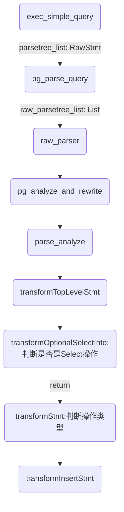
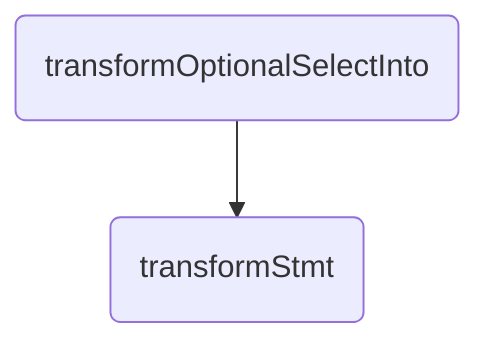
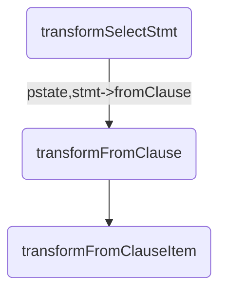
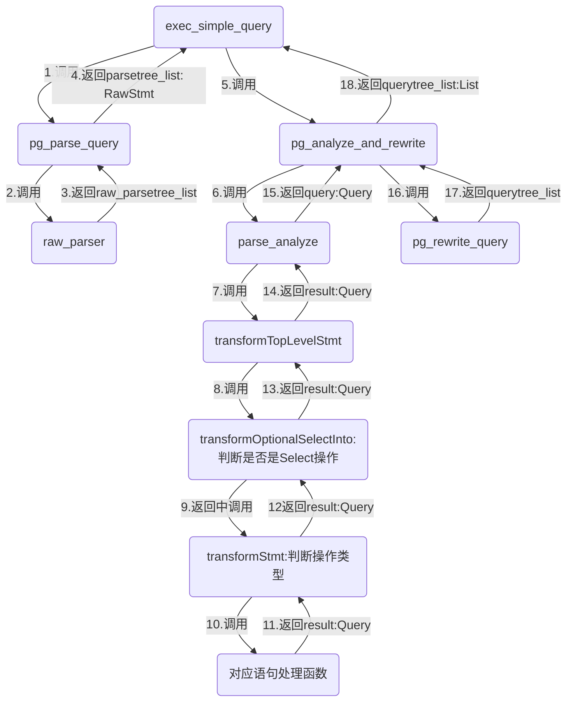

# PostgreSQL查询SQL的语法分析（1）——词法分析

postgreSQL命令的词法分析和语法分析是由Unix工具Yacc和Lex制作的。使用的是 Bison 和Flex。

## 源码结构

>src\backend\parser	解析器
>
>-- scanl.l	定义词法分析器
>
>-- gram.y	语法分析器

## 结构体

### 函数参数相关

#### ListCell

```c
struct ListCell
{
	union
	{
		void	   *ptr_value;
		int			int_value;
		Oid			oid_value;
	}			data;
	ListCell   *next;
};
```
#### ParseState

```c
struct ParseState
{
	struct ParseState *parentParseState;	/* stack link */
	const char *p_sourcetext;	/* source text, or NULL if not available */
	List	   *p_rtable;		/* range table so far */
	List	   *p_joinexprs;	/* JoinExprs for RTE_JOIN p_rtable entries */
	List	   *p_joinlist;		/* join items so far (will become FromExpr
								 * node's fromlist) */
	List	   *p_namespace;	/* currently-referenceable RTEs (List of
								 * ParseNamespaceItem) */
	bool		p_lateral_active;	/* p_lateral_only items visible? */
	List	   *p_ctenamespace; /* current namespace for common table exprs */
	List	   *p_future_ctes;	/* common table exprs not yet in namespace */
	CommonTableExpr *p_parent_cte;	/* this query's containing CTE */
	Relation	p_target_relation;	/* INSERT/UPDATE/DELETE target rel */
	RangeTblEntry *p_target_rangetblentry;	/* target rel's RTE */
	bool		p_is_insert;	/* process assignment like INSERT not UPDATE */
	List	   *p_windowdefs;	/* raw representations of window clauses */
	ParseExprKind p_expr_kind;	/* what kind of expression we're parsing */
	int			p_next_resno;	/* next targetlist resno to assign */
	List	   *p_multiassign_exprs;	/* junk tlist entries for multiassign */
	List	   *p_locking_clause;	/* raw FOR UPDATE/FOR SHARE info */
	bool		p_locked_from_parent;	/* parent has marked this subquery
										 * with FOR UPDATE/FOR SHARE */
	bool		p_resolve_unknowns; /* resolve unknown-type SELECT outputs as
									 * type text */

	QueryEnvironment *p_queryEnv;	/* curr env, incl refs to enclosing env */

	/* Flags telling about things found in the query: */
	bool		p_hasAggs;
	bool		p_hasWindowFuncs;
	bool		p_hasTargetSRFs;
	bool		p_hasSubLinks;
	bool		p_hasModifyingCTE;

	Node	   *p_last_srf;		/* most recent set-returning func/op found */

	/*
	 * Optional hook functions for parser callbacks.  These are null unless
	 * set up by the caller of make_parsestate.
	 */
	PreParseColumnRefHook p_pre_columnref_hook;
	PostParseColumnRefHook p_post_columnref_hook;
	ParseParamRefHook p_paramref_hook;
	CoerceParamHook p_coerce_param_hook;
	void	   *p_ref_hook_state;	/* common passthrough link for above */
};
```


#### Query

```c
/*
 * Query -
 *	  Parse analysis turns all statements into a Query tree
 *	  for further processing by the rewriter and planner.
 *
 *	  Utility statements (i.e. non-optimizable statements) have the
 *	  utilityStmt field set, and the rest of the Query is mostly dummy.
 *
 *	  Planning converts a Query tree into a Plan tree headed by a PlannedStmt
 *	  node --- the Query structure is not used by the executor.
 */
typedef struct Query
{
	NodeTag		type;

	CmdType		commandType;	/* select|insert|update|delete|utility */

	QuerySource querySource;	/* where did I come from? */

	uint64		queryId;		/* query identifier (can be set by plugins) */

	bool		canSetTag;		/* do I set the command result tag? */

	Node	   *utilityStmt;	/* non-null if commandType == CMD_UTILITY */

	int			resultRelation; /* rtable index of target relation for
								 * INSERT/UPDATE/DELETE; 0 for SELECT */

	bool		hasAggs;		/* has aggregates in tlist or havingQual */
	bool		hasWindowFuncs; /* has window functions in tlist */
	bool		hasTargetSRFs;	/* has set-returning functions in tlist */
	bool		hasSubLinks;	/* has subquery SubLink */
	bool		hasDistinctOn;	/* distinctClause is from DISTINCT ON */
	bool		hasRecursive;	/* WITH RECURSIVE was specified */
	bool		hasModifyingCTE;	/* has INSERT/UPDATE/DELETE in WITH */
	bool		hasForUpdate;	/* FOR [KEY] UPDATE/SHARE was specified */
	bool		hasRowSecurity; /* rewriter has applied some RLS policy */

	List	   *cteList;		/* WITH list (of CommonTableExpr's) */

	List	   *rtable;			/* list of range table entries */
	FromExpr   *jointree;		/* table join tree (FROM and WHERE clauses) */

	List	   *targetList;		/* target list (of TargetEntry) */

	OverridingKind override;	/* OVERRIDING clause */

	OnConflictExpr *onConflict; /* ON CONFLICT DO [NOTHING | UPDATE] */

	List	   *returningList;	/* return-values list (of TargetEntry) */

	List	   *groupClause;	/* a list of SortGroupClause's */

	List	   *groupingSets;	/* a list of GroupingSet's if present */

	Node	   *havingQual;		/* qualifications applied to groups */

	List	   *windowClause;	/* a list of WindowClause's */

	List	   *distinctClause; /* a list of SortGroupClause's */

	List	   *sortClause;		/* a list of SortGroupClause's */

	Node	   *limitOffset;	/* # of result tuples to skip (int8 expr) */
	Node	   *limitCount;		/* # of result tuples to return (int8 expr) */

	List	   *rowMarks;		/* a list of RowMarkClause's */

	Node	   *setOperations;	/* set-operation tree if this is top level of
								 * a UNION/INTERSECT/EXCEPT query */

	List	   *constraintDeps; /* a list of pg_constraint OIDs that the query
								 * depends on to be semantically valid */

	List	   *withCheckOptions;	/* a list of WithCheckOption's (added
									 * during rewrite) */

	/*
	 * The following two fields identify the portion of the source text string
	 * containing this query.  They are typically only populated in top-level
	 * Queries, not in sub-queries.  When not set, they might both be zero, or
	 * both be -1 meaning "unknown".
	 */
	int			stmt_location;	/* start location, or -1 if unknown */
	int			stmt_len;		/* length in bytes; 0 means "rest of string" */
} Query;

/*----------
 * FromExpr - represents a FROM ... WHERE ... construct
 *
 * This is both more flexible than a JoinExpr (it can have any number of
 * children, including zero) and less so --- we don't need to deal with
 * aliases and so on.  The output column set is implicitly just the union
 * of the outputs of the children.
 *----------
 */
typedef struct FromExpr
{
	NodeTag		type;
	List	   *fromlist;		/* List of join subtrees */
	Node	   *quals;			/* qualifiers on join, if any */
} FromExpr;

```

#### ParseState

语义分析过程的状态信息的缓存区

```c
struct ParseState
{
	struct ParseState *parentParseState;	/* stack link */
	const char *p_sourcetext;	/* source text, or NULL if not available */
	List	   *p_rtable;		/* range table so far */
	List	   *p_joinexprs;	/* JoinExprs for RTE_JOIN p_rtable entries */
	List	   *p_joinlist;		/* join items so far (will become FromExpr
								 * node's fromlist) */
	List	   *p_namespace;	/* currently-referenceable RTEs (List of
								 * ParseNamespaceItem) */
	bool		p_lateral_active;	/* p_lateral_only items visible? */
	List	   *p_ctenamespace; /* current namespace for common table exprs */
	List	   *p_future_ctes;	/* common table exprs not yet in namespace */
	CommonTableExpr *p_parent_cte;	/* this query's containing CTE */
	Relation	p_target_relation;	/* INSERT/UPDATE/DELETE target rel */
	RangeTblEntry *p_target_rangetblentry;	/* target rel's RTE */
	bool		p_is_insert;	/* process assignment like INSERT not UPDATE */
	List	   *p_windowdefs;	/* raw representations of window clauses */
	ParseExprKind p_expr_kind;	/* what kind of expression we're parsing */
	int			p_next_resno;	/* next targetlist resno to assign */
	List	   *p_multiassign_exprs;	/* junk tlist entries for multiassign */
	List	   *p_locking_clause;	/* raw FOR UPDATE/FOR SHARE info */
	bool		p_locked_from_parent;	/* parent has marked this subquery
										 * with FOR UPDATE/FOR SHARE */
	bool		p_resolve_unknowns; /* resolve unknown-type SELECT outputs as
									 * type text */

	QueryEnvironment *p_queryEnv;	/* curr env, incl refs to enclosing env */

	/* Flags telling about things found in the query: */
	bool		p_hasAggs;
	bool		p_hasWindowFuncs;
	bool		p_hasTargetSRFs;
	bool		p_hasSubLinks;
	bool		p_hasModifyingCTE;

	Node	   *p_last_srf;		/* most recent set-returning func/op found */

	/*
	 * Optional hook functions for parser callbacks.  These are null unless
	 * set up by the caller of make_parsestate.
	 */
	PreParseColumnRefHook p_pre_columnref_hook;
	PostParseColumnRefHook p_post_columnref_hook;
	ParseParamRefHook p_paramref_hook;
	CoerceParamHook p_coerce_param_hook;
	void	   *p_ref_hook_state;	/* common passthrough link for above */
};
```


### 增删改查相关

##### 公共包含结构体

```c
/*
 * RangeVar - range variable, used in FROM clauses
 *
 * Also used to represent table names in utility statements; there, the alias
 * field is not used, and inh tells whether to apply the operation
 * recursively to child tables.  In some contexts it is also useful to carry
 * a TEMP table indication here.
 */
typedef struct RangeVar
{
	NodeTag		type;
	char	   *catalogname;	/* the catalog (database) name, or NULL */
	char	   *schemaname;		/* the schema name, or NULL */
	char	   *relname;		/* the relation/sequence name */
	bool		inh;			/* expand rel by inheritance? recursively act
								 * on children? */
	char		relpersistence; /* see RELPERSISTENCE_* in pg_class.h */
	Alias	   *alias;			/* table alias & optional column aliases */
	int			location;		/* token location, or -1 if unknown */
} RangeVar;

typedef struct WithClause
{
	NodeTag		type;
	List	   *ctes;			/* list of CommonTableExprs */
	bool		recursive;		/* true = WITH RECURSIVE */
	int			location;		/* token location, or -1 if unknown */
} WithClause;

```


##### InsertStmt

```c
/* ----------------------
 *		Insert Statement
 *
 * The source expression is represented by SelectStmt for both the
 * SELECT and VALUES cases.  If selectStmt is NULL, then the query
 * is INSERT ... DEFAULT VALUES.
 * ----------------------
 */
typedef struct InsertStmt
{
	NodeTag		type;
	RangeVar   *relation;		/* relation to insert into */
	List	   *cols;			/* optional: names of the target columns */
	Node	   *selectStmt;		/* the source SELECT/VALUES, or NULL */
	OnConflictClause *onConflictClause; /* ON CONFLICT clause */
	List	   *returningList;	/* list of expressions to return */
	WithClause *withClause;		/* WITH clause */
	OverridingKind override;	/* OVERRIDING clause */
} InsertStmt;

typedef struct Alias
{
	NodeTag		type;
	char	   *aliasname;		/* aliased rel name (never qualified) */
	List	   *colnames;		/* optional list of column aliases */
} Alias;

/*pg_parse_query*/
typedef struct RawStmt
{
	NodeTag		type;
	Node	   *stmt;			/* raw parse tree */
	int			stmt_location;	/* start location, or -1 if unknown */
	int			stmt_len;		/* length in bytes; 0 means "rest of string" */
} RawStmt;
```

###### 执行语句分析

```sql
INSERT INTO weather VALUES ('cq', 46, 50, 0.25, '2022-06-20');
```

1. 函数

   ```c
   static Query *transformInsertStmt(ParseState *pstate, InsertStmt *stmt);
   ```

   

2. 变化字段

   ```c
   Query
   {
   	NodeTag		type;
   	int			resultRelation; /* rtable index of target relation for
   								 * INSERT/UPDATE/DELETE; 0 for SELECT */
   	List	   *rtable;			/* list of range table entries */
   	FromExpr   *jointree;		/* table join tree (FROM and WHERE clauses) */
   
   	List	   *targetList;		/* target list (of TargetEntry) */
   }
   ```

   打印变化

   ```c
   (gdb) print *qry.rtable 
   $12 = {
     type = T_List, 
     length = 1, 
     head = 0x17d3090, 
     tail = 0x17d3090
   }
   
   (gdb) call nodeToString(qry.rtable)
   $14 = 0x17d2b10 "({RTE :alias <> :eref {ALIAS :aliasname weather :colnames (\"city\" \"temp_lo\" \"temp_hi\" \"prcp\" \"date\")} :rtekind 0 :relid 16391 :relkind r :rellockmode 3 :tablesample <> :lateral false :inh false :inFromCl false :requiredPerms 1 :checkAsUser 0 :selectedCols (b) :insertedCols (b 8 9 10 11 12) :updatedCols (b) :extraUpdatedCols (b) :securityQuals <>})"
   
   print *(RangeTblEntry*)qry.rtable.head 
   $15 = {
     type = 24978272, 
     rtekind = RTE_RELATION, 
     relid = 0, 
     relkind = 0 '\000', 
     rellockmode = 32, 
     tablesample = 0x18, 
     subquery = 0x17ae010, 
     security_barrier = 223, 
     jointype = JOIN_LEFT, 
     joinaliasvars = 0x17d3090, 
     functions = 0x17d3090, 
     funcordinality = 126, 
     tablefunc = 0x8, 
     values_lists = 0x5, 
     ctename = 0x17ae010 <incomplete sequence \326>, 
     ctelevelsup = 2037672291, 
     self_reference = false, 
     coltypes = 0x10, 
     coltypmods = 0x10, 
     colcollations = 0x17ae010, 
     enrname = 0x17d21f0 "^\001", 
     enrtuples = 1.2342791442182855e-316, 
     alias = 0x20, 
     eref = 0x18, 
     lateral = 16, 
     inh = 224, 
     inFromCl = 122, 
     requiredPerms = 0, 
     checkAsUser = 223, 
     selectedCols = 0x17d3110, 
     insertedCols = 0x17d34a0, 
     updatedCols = 0x7f7f7f7f7f7f7f7e, 
     extraUpdatedCols = 0x10, 
     securityQuals = 0x10
   }
   
   ```
   

###### 流程



```c
   parsetree_list:{}
   parsetree_list:{RAWSTMT :stmt {} :stmt_location 0 :stmt_len 112}
   
   call nodeToString (raw_parsetree_list )
   $20 = 0x1b2a380 "{}"
   call nodeToString(raw_parsetree_list )
   $26 = 0x1b4e448 "({RAWSTMT :stmt {} :stmt_location 0 :stmt_len 112})"
```


##### DeleteStmt

```c
/* ----------------------
 *		Delete Statement
 * ----------------------
 */
typedef struct DeleteStmt
{
	NodeTag		type;
	RangeVar   *relation;		/* relation to delete from */
	List	   *usingClause;	/* optional using clause for more tables */
	Node	   *whereClause;	/* qualifications */
	List	   *returningList;	/* list of expressions to return */
	WithClause *withClause;		/* WITH clause */
} DeleteStmt;

```

###### 执行语句分析

```sql
DELETE FROM weather WHERE city = 'Hayward';
```

1. 函数

   ```c
   static Query *transformDeleteStmt(ParseState *pstate, DeleteStmt *stmt);
   ```

2. 变化字段

   ```c
   Query{
     type = T_Query, 
     commandType = CMD_DELETE, 
     querySource = QSRC_ORIGINAL, 
    
     resultRelation = 1, 
   
   
     rtable = 0x17d4310, 
     jointree = 0x17d46e0, 
   }
   ```

   

   打印

   ```c
   (gdb) print *stmt
   $7 = {
     type = T_DeleteStmt, 
     relation = 0x17aeb60, 
     usingClause = 0x0, 
     whereClause = 0x17aecf0, 
     returningList = 0x0, 
     withClause = 0x0
   }
   (gdb) print *stmt.relation 
   $6 = {
     type = T_RangeVar, 
     catalogname = 0x0, 
     schemaname = 0x0, 
     relname = 0x17aeb40 "weather", 
     inh = true, 
     relpersistence = 112 'p', 
     alias = 0x0, 
     location = 12
   }
   (gdb) print *qry
   $9 = {
     type = T_AllocSetContext, 
     commandType = CMD_UNKNOWN, 
     querySource = 13475040, 
     queryId = 24808880, 
     canSetTag = false, 
     utilityStmt = 0x1827c10, 
     resultRelation = 25586016, 
   
     hasDistinctOn = 116, 
     hasRecursive = 101, 
     hasModifyingCTE = 200, 
   
     rtable = 0x0, 
     jointree = 0x17ae0e8, 
   
     limitCount = 0x2000, 
     rowMarks = 0x800000 <expand_partitioned_rtentry+519>, 
     setOperations = 0x2000, 
     constraintDeps = 0x2000, 
     withCheckOptions = 0x17ae0e8, 
   }
   
   (gdb) print *qry
   $11 = {
     type = T_Query, 
     commandType = CMD_DELETE, 
     querySource = QSRC_ORIGINAL, 
     queryId = 0, 
     canSetTag = false, 
     utilityStmt = 0x0, 
     resultRelation = 1, 
   
     hasDistinctOn = false, 
     hasRecursive = false, 
     hasModifyingCTE = false, 
   
   
     rtable = 0x17d4310, 
     jointree = 0x17d46e0, 
   
     limitCount = 0x0, 
     rowMarks = 0x0, 
     setOperations = 0x0, 
     constraintDeps = 0x0, 
     withCheckOptions = 0x0, 
   }
   (gdb) call nodeToString (qry.rtable )
   $15 = 0x17d4f48 "({RTE :alias <> :eref {ALIAS :aliasname weather :colnames (\"city\" \"temp_lo\" \"temp_hi\" \"prcp\" \"date\")} :rtekind 0 :relid 16391 :relkind r :rellockmode 3 :tablesample <> :lateral false :inh true :inFromCl false :requiredPerms 10 :checkAsUser 0 :selectedCols (b 8) :insertedCols (b) :updatedCols (b) :extraUpdatedCols (b) :securityQuals <>})"
   (gdb) call nodeToString (qry.jointree )
   $16 = 0x17d5360 "{FROMEXPR :fromlist ({RANGETBLREF :rtindex 1}) :quals {OPEXPR :opno 98 :opfuncid 67 :opresulttype 16 :opretset false :opcollid 0 :inputcollid 100 :args ({RELABELTYPE :arg {VAR :varno 1 :varattno 1 :vartype 1043 :vartypmod 84 :varcollid 100 :varlevelsup 0 :varnoold 1 :varoattno 1 :location 26} :resulttype 25 :resulttypmod -1 :resultcollid 100 :relabelformat 2 :location -1} {CONST :consttype 25 :consttypmod -1 :constcollid 100 :constlen -1 :constbyval false :constisnull false :location 33 :constvalue 11 [ 44 0 0 0 72 97 121 119 97 114 100 ]}) :location 31}}"
   (gdb) call nodeToString(qry.jointree.fromlist )
   $19 = 0x17d5778 "({RANGETBLREF :rtindex 1})"
   (gdb) print (RangeTblRef*)qry.jointree.fromlist
   $20 = (RangeTblRef *) 0x17d4390
   (gdb) print *(RangeTblRef*)qry.jointree.fromlist
   $21 = {
     type = T_List, 
     rtindex = 1
   }
   ```

   


##### UpdateStmt

```c
/* ----------------------
 *		Update Statement
 * ----------------------
 */
typedef struct UpdateStmt
{
	NodeTag		type;
	RangeVar   *relation;		/* relation to update */
	List	   *targetList;		/* the target list (of ResTarget) */
	Node	   *whereClause;	/* qualifications */
	List	   *fromClause;		/* optional from clause for more tables */
	List	   *returningList;	/* list of expressions to return */
	WithClause *withClause;		/* WITH clause */
} UpdateStmt;

```

###### 执行语句分析

```sql
UPDATE weather
    SET temp_hi = temp_hi - 2,  temp_lo = temp_lo - 2
    WHERE date > '1994-11-28';
```

1. 函数

   ```c
   static Query *transformUpdateStmt(ParseState *pstate, UpdateStmt *stmt);
   ```

2. 变化字段

   ```c
   Query
   {
   	NodeTag		type;
   
   	CmdType		commandType;	/* select|insert|update|delete|utility */
   
   	int			resultRelation; /* rtable index of target relation for
   								 * INSERT/UPDATE/DELETE; 0 for SELECT */
   	List	   *rtable;			/* list of range table entries */
   	FromExpr   *jointree;		/* table join tree (FROM and WHERE clauses) */
   
   	List	   *targetList;		/* target list (of TargetEntry) */
   
   } Query;
   
   ```

   打印

   ```c
   (gdb) print *stmt
   $22 = {
     type = T_UpdateStmt, 
     relation = 0x17aeba0, 
     targetList = 0x17aee90, 
     whereClause = 0x17af2d8, 
     fromClause = 0x0, 
     returningList = 0x0, 
     withClause = 0x0
   }
   (gdb) call nodeToString (stmt.targetList )
   $23 = 0x17af6d8 "({RESTARGET :name temp_hi :indirection <> :val {AEXPR  :name (\"-\") :lexpr {COLUMNREF :fields (\"temp_hi\") :location 33} :rexpr {A_CONST :val 2 :location 43} :location 41} :location 23}{RESTARGET :name temp_lo :indirection <> :val {AEXPR  :name (\"-\") :lexpr {COLUMNREF :fields (\"temp_lo\") :location 57} :rexpr {A_CONST :val 2 :location 67} :location 65} :location 47})"
   (gdb) call nodeToString (stmt.relation )
   $29 = 0x17d4618 "{RANGEVAR :schemaname <> :relname weather :inh true :relpersistence p :alias <> :location 7}"
   (gdb) print *stmt.targetList 
   $24 = {
     type = T_List, 
     length = 2, 
     head = 0x17aee68, 
     tail = 0x17af138
   }
   (gdb) call nodeToString (stmt.whereClause )
   $28 = 0x17d4200 "{AEXPR  :name (\">\") :lexpr {COLUMNREF :fields (\"date\") :location 79} :rexpr {A_CONST :val \"\\1994-11-28\" :location 86} :location 84}"
   (gdb) print *qry
   $33 = {
     type = T_Query, 
     commandType = CMD_UPDATE, 
    
     resultRelation = 1, 
   
     rtable = 0x17afad8, 
     jointree = 0x17d4498, 
     targetList = 0x17d4228, 
   }
   ```

   


##### SelectStmt

```c
/* ----------------------
 *		Select Statement
 *
 * A "simple" SELECT is represented in the output of gram.y by a single
 * SelectStmt node; so is a VALUES construct.  A query containing set
 * operators (UNION, INTERSECT, EXCEPT) is represented by a tree of SelectStmt
 * nodes, in which the leaf nodes are component SELECTs and the internal nodes
 * represent UNION, INTERSECT, or EXCEPT operators.  Using the same node
 * type for both leaf and internal nodes allows gram.y to stick ORDER BY,
 * LIMIT, etc, clause values into a SELECT statement without worrying
 * whether it is a simple or compound SELECT.
 * ----------------------
 */

typedef struct SelectStmt
{
	NodeTag		type;

	/*
	 * These fields are used only in "leaf" SelectStmts.
	 */
	List	   *distinctClause; /* NULL, list of DISTINCT ON exprs, or
								 * lcons(NIL,NIL) for all (SELECT DISTINCT) */
	IntoClause *intoClause;		/* target for SELECT INTO */
	List	   *targetList;		/* the target list (of ResTarget) */
	List	   *fromClause;		/* the FROM clause */
	Node	   *whereClause;	/* WHERE qualification */
	List	   *groupClause;	/* GROUP BY clauses */
	Node	   *havingClause;	/* HAVING conditional-expression */
	List	   *windowClause;	/* WINDOW window_name AS (...), ... */

	/*
	 * In a "leaf" node representing a VALUES list, the above fields are all
	 * null, and instead this field is set.  Note that the elements of the
	 * sublists are just expressions, without ResTarget decoration. Also note
	 * that a list element can be DEFAULT (represented as a SetToDefault
	 * node), regardless of the context of the VALUES list. It's up to parse
	 * analysis to reject that where not valid.
	 */
	List	   *valuesLists;	/* untransformed list of expression lists */

	/*
	 * These fields are used in both "leaf" SelectStmts and upper-level
	 * SelectStmts.
	 */
	List	   *sortClause;		/* sort clause (a list of SortBy's) */
	Node	   *limitOffset;	/* # of result tuples to skip */
	Node	   *limitCount;		/* # of result tuples to return */
	List	   *lockingClause;	/* FOR UPDATE (list of LockingClause's) */
	WithClause *withClause;		/* WITH clause */

	/*
	 * These fields are used only in upper-level SelectStmts.
	 */
	SetOperation op;			/* type of set op */
	bool		all;			/* ALL specified? */
	struct SelectStmt *larg;	/* left child */
	struct SelectStmt *rarg;	/* right child */
	/* Eventually add fields for CORRESPONDING spec here */
} SelectStmt;

typedef enum SetOperation
{
	SETOP_NONE = 0,
	SETOP_UNION,
	SETOP_INTERSECT,
	SETOP_EXCEPT
} SetOperation;
```

###### 执行语句分析

```sql
SELECT * FROM weather;
```

1. 函数

   ```c
   static Query *transformDeleteStmt(ParseState *pstate, DeleteStmt *stmt);
   ```

   

2. 变化字段

   ```c
   Query
   {
   	NodeTag		type;
   
   	CmdType		commandType;	/* select|insert|update|delete|utility */
   
   	List	   *rtable;			/* list of range table entries */
   	FromExpr   *jointree;		/* table join tree (FROM and WHERE clauses) */
   
   	List	   *targetList;		/* target list (of TargetEntry) */
   
   } Query;
   ```

   

   打印

   ```c
   (gdb) print *stmt
   $37 = {
     type = T_SelectStmt, 
     distinctClause = 0x0, 
     intoClause = 0x0, 
     targetList = 0x17aec58, 
     fromClause = 0x17aed30, 
     whereClause = 0x0, 
     groupClause = 0x0, 
     havingClause = 0x0, 
     windowClause = 0x0, 
     valuesLists = 0x0, 
     sortClause = 0x0, 
     limitOffset = 0x0, 
     limitCount = 0x0, 
     lockingClause = 0x0, 
     withClause = 0x0, 
     op = SETOP_NONE, 
     all = false, 
     larg = 0x0, 
     rarg = 0x0
   }
   (gdb) call nodeToString(stmt.t
   targetList  type        
   (gdb) call nodeToString(stmt.targetList )
   $38 = 0x17af148 "({RESTARGET :name <> :indirection <> :val {COLUMNREF :fields ({A_STAR}) :location 7} :location 7})"
   (gdb) call nodeToString(stmt.fromClause )
   $39 = 0x17af560 "({RANGEVAR :schemaname <> :relname weather :inh true :relpersistence p :alias <> :location 14})"
   (gdb) print *qry
   $49 = {
     type = T_Query, 
     commandType = CMD_SELECT, 
     
     rtable = 0x17d5220, 
     jointree = 0x17d5b08, 
     targetList = 0x17d58a8, 
   }
   (gdb) call nodeToString( qry.rtable )
   $51 = 0x17d5b40 "({RTE :alias <> :eref {ALIAS :aliasname weather :colnames (\"city\" \"temp_lo\" \"temp_hi\" \"prcp\" \"date\")} :rtekind 0 :relid 16391 :relkind r :rellockmode 1 :tablesample <> :lateral false :inh true :inFromCl true :requiredPerms 2 :checkAsUser 0 :selectedCols (b 8 9 10 11 12) :insertedCols (b) :updatedCols (b) :extraUpdatedCols (b) :securityQuals <>})"
   (gdb) call nodeToString( qry.jointree )
   $52 = 0x187ebd0 "{FROMEXPR :fromlist ({RANGETBLREF :rtindex 1}) :quals <>}"
   (gdb) call nodeToString( qry.targetList )
   $53 = 0x187f400 "({TARGETENTRY :expr {VAR :varno 1 :varattno 1 :vartype 1043 :vartypmod 84 :varcollid 100 :varlevelsup 0 :varnoold 1 :varoattno 1 :location 7} :resno 1 :resname city :ressortgroupref 0 :resorigtbl 16391 :resorigcol 1 :resjunk false} {TARGETENTRY :expr {VAR :varno 1 :varattno 2 :vartype 23 :vartypmod -1 :varcollid 0 :varlevelsup 0 :varnoold 1 :varoattno 2 :location 7} :resno 2 :resname temp_lo :ressortgroupref 0 :resorigtbl 16391 :resorigcol 2 :resjunk false} {TARGETENTRY :expr {VAR :varno 1 :varattno 3 :vartype 23 :vartypmod -1 :varcollid 0 :varlevelsup 0 :varnoold 1 :varoattno 3 :location 7} :resno 3 :resname temp_hi :ressortgroupref 0 :resorigtbl 16391 :resorigcol 3 :resjunk false} {TARGETENTRY :expr {VAR :varno 1 :varattno 4 :vartype 700 :vartypmod -1 :varcollid 0 :varlevelsup 0 :varnoold 1 :varoattno 4 :location 7} :resno 4 :resname prcp :ressortgroupref 0 :resorigtbl 16391 :resorigcol 4 :resjunk false} {TARGETENTRY :expr {VAR :varno 1 :varattno 5 :vartype 1082 :vartypmod -1 :varcollid 0 :varlevelsup 0 :varnoold 1 :varoattno 5 :location 7} :resno 5 :resname date :ressortgroupref 0 :resorigtbl 16391 :resorigcol 5 :resjunk false})"
   (gdb) print *(FromExpr*)qry.jointree.fromlist.head.data.ptr_value 
   $61 = {
     type = T_RangeTblRef, 
     fromlist = 0x10, 
     quals = 0x10
   }
   (gdb) print *(RangeTblRef*)qry.jointree.fromlist.head.data.ptr_value 
   $1 = {type = T_RangeTblRef, rtindex = 1}
   ```

###### 流程






```


```


```c
(gdb) print stmt->fromClause.length 
$1 = 1
(gdb) call nodeToString (stmt->fromClause )
$2 = 0x17d21f0 "({RANGEVAR :schemaname <> :relname weather :inh true :relpersistence p :alias <> :location 14})"
(gdb) call nodeToString (stmt->fromClause.head )
$3 = 0x17d28d8 "{}"
(gdb) print stmt->fromClause.head.next 
$4 = (ListCell *) 0x0
(gdb) print stmt->fromClause.head
$5 = (ListCell *) 0x17aed08
(gdb) print stmt->fromClause.tail 
$6 = (ListCell *) 0x17aed08
(gdb) print stmt->fromClause.head.data 
$7 = {ptr_value = 0x17aecb0, int_value = 24833200, 
  oid_value = 24833200}
(gdb) print (RANGEVAR*)stmt->fromClause.head.data.ptr_value 
No symbol "RANGEVAR" in current context.
(gdb) print (RangeVar*)stmt->fromClause.head.data.ptr_value 
$8 = (RangeVar *) 0x17aecb0
(gdb) print *(RangeVar*)stmt->fromClause.head.data.ptr_value 
$9 = {type = T_RangeVar, catalogname = 0x0, schemaname = 0x0, 
  relname = 0x17aec90 "weather", inh = true, 
  relpersistence = 112 'p', alias = 0x0, location = 14}
```

## 公共流程




## 函数释义

### 语义分析

#### 处理接口transformXxxStmt


#### transformOptionalSelectInto

处理SetOperation；如果有intoClause,则将其放入parseTree。set operators 包括：(UNION, INTERSECT, EXCEPT) 。是


### transformExprRecurse

```c
typedef struct Const
{
	Expr		xpr;
	Oid			consttype;		/* pg_type OID of the constant's datatype */
	int32		consttypmod;	/* typmod value, if any */
	Oid			constcollid;	/* OID of collation, or InvalidOid if none */
	int			constlen;		/* typlen of the constant's datatype */
	Datum		constvalue;		/* the constant's value */
	bool		constisnull;	/* whether the constant is null (if true,
								 * constvalue is undefined) */
	bool		constbyval;		/* whether this datatype is passed by value.
								 * If true, then all the information is stored
								 * in the Datum. If false, then the Datum
								 * contains a pointer to the information. */
	int			location;		/* token location, or -1 if unknown */
} Const;
```


